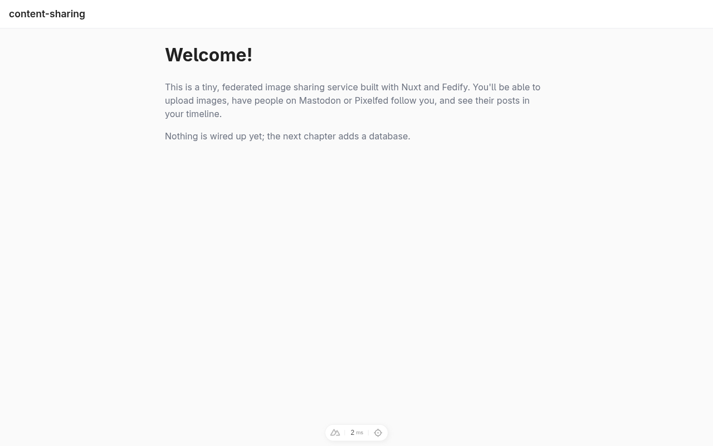
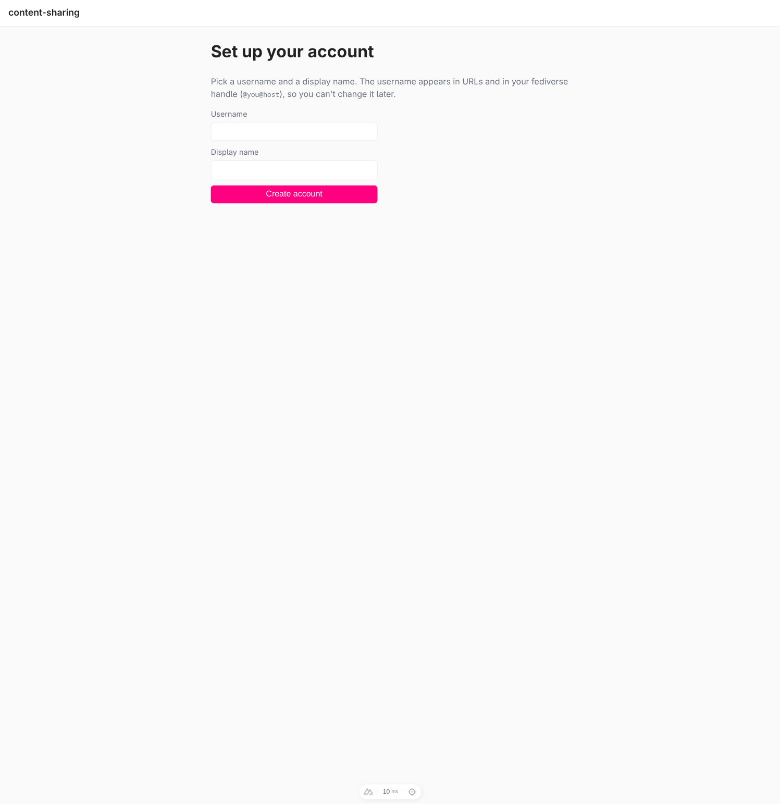

Creating your own federated image sharing service
=================================================

In this tutorial, we will build a small [Pixelfed]-style federated image
sharing service on top of [Nuxt] and [Fedify]. Like the
[microblog tutorial](./microblog.md), this one focuses on how to use Fedify,
not on the low-level details of the ActivityPub protocol.

The companion repository is available at [fedify-dev/content-sharing]. Each
chapter corresponds to one or two commits there, so you can always compare
your progress with a known-good checkpoint.

If you have any questions, suggestions, or feedback, please join our
[Matrix chat space] or [GitHub Discussions].

[Pixelfed]: https://pixelfed.org/
[Nuxt]: https://nuxt.com/
[Fedify]: https://fedify.dev/
[fedify-dev/content-sharing]: https://github.com/fedify-dev/content-sharing
[Matrix chat space]: https://matrix.to/#/#fedify:matrix.org
[GitHub Discussions]: https://github.com/fedify-dev/fedify/discussions

Target audience
---------------

This tutorial is aimed at people who want to learn how to build
ActivityPub-speaking software with Fedify, using a fullstack web framework
they already know (or would like to learn) rather than a bare HTTP library.

We assume that you can write basic JavaScript and that you're comfortable
with HTML, HTTP, and the command line.  You don't need to know TypeScript,
SQL, Vue, or ActivityPub in advance: we'll introduce them as we go.

You don't need to have built ActivityPub software before, but we do assume
that you've used at least one fediverse service such as [Mastodon],
[Misskey], or Pixelfed itself, so you have a mental picture of the kind of
product we're building.

[Mastodon]: https://joinmastodon.org/
[Misskey]: https://misskey-hub.net/

Goals
-----

We're going to build a single-user service that lets you share photos with
the rest of the fediverse.  By the end of this tutorial, your server will
be able to:

 -  Expose a single user account with a profile page.
 -  Receive follow requests from accounts on other fediverse servers.
 -  Let followers unfollow you.
 -  Show the list of accounts following you.
 -  Upload an image together with a caption and make it a *post*.
 -  Deliver those posts to every follower's inbox across the network.
 -  Let you follow accounts on other servers.
 -  Show the list of accounts you follow.
 -  Show a chronological timeline of posts from accounts you follow.
 -  Let both sides like posts.
 -  Let both sides reply to posts with short comments.

To keep the tutorial focused we'll leave out the following, on purpose:

 -  Profile fields such as bio and avatar cannot be edited.
 -  Once created, an account cannot be deleted.
 -  Posts, likes, and comments cannot be edited or deleted.
 -  No authentication or permission checks.  Anyone who can reach the
    server can post through it.  We'll only use it locally.
 -  No search, no hashtags, no direct messages, no boosts, no stories.

All of these are great follow-up exercises once you've finished the
tutorial.

Setting up the development environment
--------------------------------------

### Installing Node.js

Fedify supports three JavaScript runtimes: [Deno], [Bun], and [Node.js].
We'll use Node.js in this tutorial because Nuxt targets it by default.

> [!TIP]
> A JavaScript runtime is a platform that executes JavaScript code.  Web
> browsers are one kind of JavaScript runtime, and for command-line or
> server use, Node.js is the most common choice.

You need Node.js 22.0.0 or higher.  There are
[various installation methods]; pick whichever suits you best.  Once it's
installed, you'll have the `node` and `npm` commands on your `PATH`:

~~~~ sh
node --version
npm --version
~~~~

[Deno]: https://deno.com/
[Bun]: https://bun.sh/
[Node.js]: https://nodejs.org/
[various installation methods]: https://nodejs.org/en/download/package-manager

### Installing the `fedify` command

To scaffold a Fedify project you need the [`fedify`](../cli.md) command.
There are [several installation methods](../cli.md#installation); the
simplest is to install it globally with `npm`:

~~~~ sh
npm install -g @fedify/cli
~~~~

Check that it is available and on a recent enough version:

~~~~ sh
fedify --version
~~~~

For this tutorial you need 2.2.0 or higher.

### `fedify init` to scaffold the project

Let's pick a directory name for our project.  We'll use *content-sharing*
here.  Run [`fedify init`](../cli.md#fedify-init-initializing-a-fedify-project)
with the directory path (it's fine if the directory doesn't exist yet) and
four flags telling it exactly what kind of project we want:

~~~~ sh
fedify init -w nuxt -p npm -k in-memory -m in-process content-sharing
~~~~

What those flags mean:

`-w nuxt`
:   Generate a [Nuxt] project and wire it up with [`@fedify/nuxt`], Fedify's
    Nuxt integration module.  Nuxt will handle all the HTML pages and
    REST-style endpoints, and `@fedify/nuxt` will take care of ActivityPub
    requests.

`-p npm`
:   Use `npm` as the package manager.  Swap for `pnpm`, `yarn`, or `bun` if
    you prefer.

`-k in-memory`
:   Use an in-memory key–value store for Fedify's caches (e.g., remote
    actor lookups).  This means data disappears when you stop the server,
    which is fine while you're learning.  For production you'd use Redis
    or PostgreSQL.

`-m in-process`
:   Use the in-process message queue to deliver outgoing activities.  Again
    fine for development, but a production deployment would use something
    like Redis or AMQP so that retries survive a restart.

The command installs a few hundred npm packages and prints instructions
for the next step.  Once it's done, your directory should look roughly like
this:

 -  *.vscode/*: editor settings for Biome and ESLint.
 -  *app/*: the Nuxt application directory.
     -  *app.vue*: the root Vue component.
 -  *public/*: static assets served as-is.
 -  *server/*: server-only code.
     -  *federation.ts*: our Fedify `Federation` instance.
     -  *logging.ts*: the [LogTape] logging configuration.
 -  *biome.json*: formatter settings.
 -  *eslint.config.ts*: linter settings.
 -  *nuxt.config.ts*: Nuxt configuration.
 -  *package.json*: project metadata and dependencies.
 -  *tsconfig.json*: TypeScript configuration.

As you can see, the code is TypeScript (the *.ts* and *.vue* files).
We'll cover enough TypeScript as we go; no prior experience is required.

> [!NOTE]
> You might notice that `biome check` complains about the generated
> *biome.json* on a brand-new project because it targets a slightly
> different Biome schema version than the one installed, and because it
> also tries to format the auto-generated *.nuxt/* files. The companion
> repository includes a one-off fix for this in the initial commit; you
> can apply the same tweak by setting `"$schema"` to the version of Biome
> you have installed and adding
> `"files": { "includes": ["**", "!.nuxt/**", "!.output/**", "!dist/**", "!node_modules/**"] }`.

[`@fedify/nuxt`]: https://github.com/fedify-dev/fedify/tree/main/packages/nuxt
[LogTape]: https://logtape.org/

### Running the dev server for the first time

Change into the project directory and start the dev server:

~~~~ sh
cd content-sharing
npm run dev
~~~~

Nuxt picks a free port (usually 3000, or 3001 if 3000 is already taken)
and prints a URL.  Open it in your browser; you should see the default
Nuxt welcome page:

We'll replace this welcome page soon, but first let's confirm that Fedify
is already doing its job.  Open a second terminal and ask Fedify to look
up an actor that exists only in-memory on our brand-new server:

~~~~ sh
fedify lookup http://localhost:3000/users/john
~~~~

> [!TIP]
> If Nuxt picked port 3001 because 3000 was taken, adjust the URL
> accordingly (and in every `fedify lookup` or `curl` command later in this
> tutorial).

You should see something like:

~~~~ console
✔ Looking up the object...
Person {
  id: URL "http://localhost:3000/users/john",
  name: "john",
  preferredUsername: "john"
}
~~~~

That means the scaffold already includes a working ActivityPub *actor
dispatcher*, mapped to `/users/{identifier}`.  It returns a `Person`
object whose name and preferred username are both the identifier from the
URL.  We'll change this shortly so that it only returns a real actor when
a matching user exists in our database.

> [!TIP]
> If you'd rather avoid installing the `fedify` command right now, you can
> make the same request with `curl` by sending the `Accept` header that
> ActivityPub clients use:
>
> ~~~~ sh
> curl -H 'Accept: application/activity+json' \
>   http://localhost:3000/users/john | jq .
> ~~~~
>
> The `jq` at the end pretty-prints the JSON-LD response.

Leave the dev server running in one terminal; we'll keep coming back to
it.  Stop it any time with <kbd>Ctrl</kbd>+<kbd>C</kbd>.

### Visual Studio Code

[Visual Studio Code] is the editor we recommend while following this
tutorial.  The generated project ships with editor settings and extension
recommendations for [Biome] (formatter) and [ESLint] (linter), so you
won't have to fight indentation or import order.

> [!WARNING]
> Don't confuse this with Visual Studio.  Visual Studio Code and Visual
> Studio share a brand name but are completely different software.

After [installing Visual Studio Code], open the project directory via
*File* → *Open Folder…*.  If a popup asks whether to install the
recommended Biome and Vue extensions, click *Install*.

> [!TIP]
> If you're a loyal Emacs or Vim user, feel free to stay with your
> favorite editor.  In that case, set up TypeScript LSP and the
> [Volar][Vue LSP] Vue language server so that you get the same inline
> type checking and autocompletion.

*[LSP]: Language Server Protocol

[Visual Studio Code]: https://code.visualstudio.com/
[Biome]: https://biomejs.dev/
[ESLint]: https://eslint.org/
[installing Visual Studio Code]: https://code.visualstudio.com/docs/setup/setup-overview
[Vue LSP]: https://marketplace.visualstudio.com/items?itemName=Vue.volar

Prerequisites
-------------

### TypeScript in a nutshell

Before we start modifying code, let's quickly walk through the parts of
TypeScript we'll actually use.  If you already know TypeScript, skip to
the next section.

TypeScript is JavaScript with static type checking bolted on.  The syntax
is almost the same, with one big addition: you can give variables,
parameters, and function return values an explicit *type*, usually written
after a colon.

~~~~ typescript twoslash
let username: string = "alice";
let followers: number = 0;
~~~~

If you try to put a value of the wrong type into such a variable, Visual
Studio Code will draw a red squiggly line under it before you even run the
program:

~~~~ typescript twoslash
// @errors: 2322
let username: string = 42;
~~~~

A type can be nullable:

~~~~ typescript twoslash
let caption: string | null = null;
caption = "hello";
~~~~

The `?` suffix on a parameter means “this argument is optional”:

~~~~ typescript twoslash
function greet(name: string, greeting?: string): string {
  return `${greeting ?? "Hello"}, ${name}!`;
}
~~~~

You'll mostly be *reading* TypeScript types.  When the tutorial writes
`async (ctx, identifier) => { ... }`, TypeScript will work out the types
of `ctx` and `identifier` for you from the surrounding context.  When
Visual Studio Code disagrees with what we've written, hover over the red
underline and read the message; it usually tells you exactly what is
wrong.

### Vue and Nuxt in a nutshell

Nuxt is a meta-framework built on top of [Vue].  We'll only use a thin
slice of it:

 -  Each file under *app/pages/* becomes a route.  For example,
    `app/pages/users/[username].vue` handles the URL
    `/users/<anything>`.

 -  A page is a [Vue Single-File Component]: one *.vue* file that mixes a
    template, a script, and optional styles.

    ~~~~ vue
    

    <template>
      <h1>Hello, {{ name }}!</h1>
    </template>

    
    ~~~~

 -  Each file under *server/api/* becomes an HTTP endpoint.  For example,
    *server/api/posts.post.ts* handles `POST /api/posts`.

 -  Each file under *server/* that is not inside *api/* is server-only
    code you can import from anywhere on the server (middleware, helper
    modules, our Fedify configuration, etc.).

That's the whole mental model you need for now.  The
[Nuxt documentation][Nuxt] is excellent if you want to go deeper later.

[Vue]: https://vuejs.org/
[Vue Single-File Component]: https://vuejs.org/guide/scaling-up/sfc.html

### What is ActivityPub, roughly?

[ActivityPub] is the protocol that lets Mastodon, Misskey, Pixelfed, and
hundreds of other servers talk to each other as one big network: the
*fediverse*.  Every fediverse account is represented by an *actor* (most
commonly a `Person`), and every action such as following, posting, or
liking is represented by an *activity* (such as `Follow`, `Create(Note)`,
or `Like`).

Servers deliver activities to each other by `POST`ing them to the
recipient's *inbox*.  We'll see that in practice soon; Fedify handles the
HTTP signatures, retries, and so on for us.

[ActivityPub]: https://www.w3.org/TR/activitypub/

A minimal app shell
-------------------

Before we touch Fedify, let's replace the stock Nuxt welcome page with
an app shell that future chapters can hang pages off.  Three files
change: *app/app.vue*, a brand-new *app/pages/index.vue*, and *README.md*.

### `app/app.vue`

Open *app/app.vue* and replace the entire file with:

~~~~ vue [app/app.vue]
<template>
  

    <header class="site-header">
      <NuxtLink to="/" class="site-title">content-sharing</NuxtLink>
    </header>
    <main class="site-main">
      <NuxtPage />
    </main>
  

</template>

~~~~

The important pieces:

 -  `<NuxtPage />` is Nuxt's router outlet.  Whatever route the visitor
    is on, the matching page from *app/pages/* is rendered here.
 -  The `
~~~~

Two things to notice:

 -  `
~~~~

A few things that are worth calling out:

`ref(...)`
:   Vue's primitive for reactive state.  `username`, `name`,
    `submitting`, and `error` each hold a value that the template
    re-reads whenever it changes.  Read and write them as `.value` in
    script code; in the template you can use them bare.

`v-model="username"`
:   Two-way binds the `<input>` to the `username` ref.  Typing into
    the input updates the ref, which in turn updates anything else
    that reads it.

`@submit.prevent="submit"`
:   Catches the form's submit event, prevents the default full-page
    reload, and calls our `submit` function.

`$fetch(...)`
:   Nuxt's wrapper around `fetch` that automatically handles JSON
    and, on error, throws an error object that carries `statusMessage`
    and `statusCode`.  We read `statusMessage` out of the thrown
    object and show it to the user.

`navigateTo("/")`
:   Nuxt's programmatic navigation helper.  After the server accepts
    the payload we bounce back to the landing page; a later chapter
    will replace that landing page with a proper profile.

The `
~~~~

Breaking that down:

`import type { User } from "~~/server/db/schema"`
:   Pulls in the row type Drizzle inferred for us in the previous
    chapter.  `~~/` is Nuxt's alias for the project root, so this
    resolves to *server/db/schema.ts*.  The `import type` keeps this
    import types-only; no server code ends up bundled into the browser
    script.

`useRoute()`, `useRequestURL()`
:   Nuxt composables.  `useRoute()` gives us route params; we cast
    `route.params.username` to `string` because Vue Router types it
    more permissively than we need.  `useRequestURL()` returns a
    `URL`-shaped object representing the incoming request; in SSR
    that's the real URL the browser asked for, on the client it's
    derived from `window.location`.

`useFetch<User>(...)`
:   A data-fetching composable that runs on the server during SSR
    and, when the page hydrates in the browser, reuses the payload.
    If the endpoint throws, the `error` ref becomes populated instead
    of `data`.  The `<User>` generic lines our page's view of the
    response up with what the API returns.

`computed(() => ...)`
:   Vue's derived state.  `handle` re-evaluates whenever `user` or
    `requestUrl.host` change, which will matter later when we hit the
    same page with different `username` route params.

`v-if`, `v-else-if`
:   Template conditionals.  When the fetch succeeds we show the
    profile header; when it errors we show the ‘not found’ state.
    There's no explicit loading state because with SSR the data is
    already resolved before the template renders.

### Trying it out

With the dev server still running, visit the URL matching the account
we created:

<http://localhost:3000/users/alice>

The profile header appears with the display name and the fediverse
handle, built from the host in the current URL:

Try a nonexistent username to exercise the 404 path:

<http://localhost:3000/users/nobody>

The handle on the real profile still shows `@alice@localhost:3000`,
which is technically true but useless to the rest of the fediverse:
nobody outside this machine can resolve that hostname.  In a later
chapter we'll run `fedify tunnel` to get a public URL, and the handle
will update itself automatically because `useRequestURL()` reads the
actual request host.

But before anyone on the fediverse can follow Alice, they need to be
able to look Alice up through ActivityPub.  That's the next chapter.

Implementing the actor
----------------------

Everything so far has been plain Nuxt.  Starting with this chapter,
the server finally starts speaking ActivityPub.  We'll tell Fedify
how to look up one of our users and turn the row into an ActivityPub
[`Person`] actor.

[`Person`]: https://www.w3.org/TR/activitystreams-vocabulary/#dfn-person

### One URL, two representations

A Fedify-powered Nuxt app shares a single URL between two audiences:

 -  Browsers that ask for HTML (`Accept: text/html`) go to the Nuxt
    page at `app/pages/users/[username].vue` and see the profile from
    the previous chapter.
 -  Fediverse clients (Mastodon, Misskey, Pixelfed, or `fedify lookup`) ask for
    `application/activity+json`, and `@fedify/nuxt` routes those requests to
    Fedify, which turns the user into a JSON-LD actor document.

The two never conflict because the `@fedify/nuxt` middleware in front
of Nitro sniffs the `Accept` header and decides which side responds.
This is a key reason Nuxt pairs well with Fedify: we don't have to
carve out a separate subdomain or path prefix.

### The actor dispatcher

Open the generated *server/federation.ts* and replace the scaffold
with this:

~~~~ typescript [server/federation.ts]
import {
  createFederation,
  InProcessMessageQueue,
  MemoryKvStore,
} from "@fedify/fedify";
import { Endpoints, Person } from "@fedify/vocab";
import { getLogger } from "@logtape/logtape";
import { eq } from "drizzle-orm";
import { users } from "./db/schema";
import { db } from "./utils/db";

const logger = getLogger("content-sharing");

const federation = createFederation({
  kv: new MemoryKvStore(),
  queue: new InProcessMessageQueue(),
});

federation
  .setActorDispatcher("/users/{identifier}", (ctx, identifier) => {
    const user = db
      .select()
      .from(users)
      .where(eq(users.username, identifier))
      .get();
    if (user == null) return null;

    const actorUri = ctx.getActorUri(identifier);
    return new Person({
      id: actorUri,
      preferredUsername: user.username,
      name: user.name,
      inbox: ctx.getInboxUri(identifier),
      endpoints: new Endpoints({
        sharedInbox: ctx.getInboxUri(),
      }),
      url: actorUri,
    });
  })
  .mapHandle((_ctx, handle) => {
    const user = db
      .select()
      .from(users)
      .where(eq(users.username, handle))
      .get();
    return user == null ? null : handle;
  });

federation.setInboxListeners("/users/{identifier}/inbox", "/inbox");

logger.debug("federation configured");

export default federation;
~~~~

There's a lot going on in that block.  Let's walk through it.

`federation.setActorDispatcher("/users/{identifier}", ...)`
:   Tells Fedify that actors live at URIs shaped like
    `/users/{identifier}`, the same path our Nuxt page already
    handles.  The `{identifier}` placeholder becomes the second
    argument of the callback, so when `/users/alice` is requested
    with an ActivityPub `Accept` header, `identifier` is `"alice"`.

`db.select().from(users).where(eq(users.username, identifier)).get()`
:   Look the user up by username.  Returning `null` when no row
    matches makes Fedify respond with `404 Not Found` for that actor.

`ctx.getActorUri(identifier)`
:   Builds the absolute actor URI for a given identifier on the
    current request.  Passing the same identifier we were given makes
    the returned `id` line up with the incoming URL.

`new Person({ ... })`
:   The ActivityStreams `Person` object.  We fill in:

     -  `id`: the canonical actor URI.
     -  `preferredUsername`: the short handle that appears in
        `@alice@host`.
     -  `name`: the display name.
     -  `inbox`: where other servers POST activities for this actor.
     -  `endpoints.sharedInbox`: an optional server-wide inbox used to
        collapse one delivery per remote server instead of one per
        actor.  We'll need this when delivering to large instances.
     -  `url`: the profile URL a browser should open.  We set it to
        the same URL as `id`; the shared-route design means an actor
        URI is already a human-visitable profile URL.

`.mapHandle((_ctx, handle) => ...)`
:   [WebFinger] lookups arrive as a handle (`alice`, without the
    leading `@`) and need to map back to a dispatcher `{identifier}`.
    Because we chose to use the username as the identifier, the
    mapping is the identity function, but we still check that the row
    exists so a `@ghost@host` lookup returns a clean 404 instead of
    a fake actor.

`federation.setInboxListeners("/users/{identifier}/inbox", "/inbox")`
:   Registers the per-actor inbox URI template and the server-wide
    shared inbox URL.  We pass no handlers yet because no remote
    server will send us an activity before we're reachable over the
    internet.  Later chapters will chain `.on(Follow, ...)`,
    `.on(Undo, ...)`, and friends onto this call to actually process
    activities.  Registering the paths up front is what lets
    `ctx.getInboxUri()` above return real URLs today.

[WebFinger]: https://datatracker.ietf.org/doc/html/rfc7033

### Trying the actor out

With the dev server running, visit `/users/alice` in the browser.
Nothing has changed visually; you still see Alice's profile.  Now try
the same URL but as an ActivityPub client would:

~~~~ sh
fedify lookup http://localhost:3000/users/alice
~~~~

~~~~ console
- Looking up the object...
✔ Fetched object: http://localhost:3000/users/alice
Person {
  id: URL 'http://localhost:3000/users/alice',
  name: 'Alice Wonderland',
  url: URL 'http://localhost:3000/users/alice',
  preferredUsername: 'alice',
  inbox: URL 'http://localhost:3000/users/alice/inbox',
  endpoints: Endpoints { sharedInbox: URL 'http://localhost:3000/inbox' }
}
✔ Successfully fetched the object.
~~~~

Same URL, completely different response.  `fedify lookup` asked for
`application/activity+json`; the `@fedify/nuxt` middleware spotted
that and routed the request to our dispatcher, which pulled Alice out
of SQLite and returned a `Person`.

If you prefer `curl` with `jq`:

~~~~ sh
curl -H 'Accept: application/activity+json' \
  http://localhost:3000/users/alice | jq .
~~~~

And looking up an account that doesn't exist returns 404 as expected:

~~~~ sh
fedify lookup http://localhost:3000/users/nobody
~~~~

~~~~ console
✘ Failed to fetch object.
~~~~

Alice is now discoverable locally, but real fediverse instances need
a cryptographic identity before they'll trust our server.  That's
what we add in the next chapter.

Cryptographic key pairs
-----------------------

Up until now the actor document has been unsigned.  To actually
deliver activities, every request we send has to be signed, and every
object we publish has to carry an integrity proof.  Both of those
require a private key whose matching public key is advertised on the
actor.  Fediverse servers currently use two signing schemes:

 -  **HTTP Signatures** (FEP-521a), using an RSA key pair.  This is
    what Mastodon verifies on every inbound delivery.
 -  **Object Integrity Proofs** (FEP-8b32), using an Ed25519 key pair.
    This is the newer, more compact signature that forwarded objects
    carry.

We want to support both, so each account has two key pairs.

### Storing the keys

Add a `keys` table that keys off `user_id` plus the algorithm name.
Open *server/db/schema.ts* and extend it:

~~~~ typescript twoslash [server/db/schema.ts]
import { sql } from "drizzle-orm";
import {
  check,
  integer,
  primaryKey,
  sqliteTable,
  text,
} from "drizzle-orm/sqlite-core";

export const users = sqliteTable(
  "users",
  {
    id: integer("id").primaryKey({ autoIncrement: false }),
    username: text("username").notNull().unique(),
    name: text("name").notNull(),
  },
  (table) => [check("single_user", sql`${table.id} = 1`)],
);

export type User = typeof users.$inferSelect;
export type NewUser = typeof users.$inferInsert;

export const keys = sqliteTable(
  "keys",
  {
    userId: integer("user_id")
      .notNull()
      .references(() => users.id, { onDelete: "cascade" }),
    type: text("type", { enum: ["RSASSA-PKCS1-v1_5", "Ed25519"] }).notNull(),
    privateKey: text("private_key").notNull(),
    publicKey: text("public_key").notNull(),
  },
  (table) => [primaryKey({ columns: [table.userId, table.type] })],
);

export type Key = typeof keys.$inferSelect;
~~~~

What's new:

 -  `userId` is a foreign key into `users.id`.  `onDelete: "cascade"`
    means if we ever delete the user, SQLite drops their keys too.
 -  `type` is constrained to the two algorithm names Fedify knows how
    to generate.  Drizzle's enum column keeps the TypeScript type
    tight.
 -  Both keys are stored as JSON strings of a
    [JSON Web Key][JWK]; we serialize on write with `exportJwk` and
    parse back on read with `importJwk`.  JWK is a compact, standard
    way to store keys.
 -  `primaryKey({ columns: [userId, type] })` makes `(user_id, type)`
    a composite primary key so each user has at most one row per
    algorithm.

Apply the migration:

~~~~ sh
npm run db:push
~~~~

[JWK]: https://datatracker.ietf.org/doc/html/rfc7517

### Generating and serving the keys

Now rewrite *server/federation.ts* to generate the key pairs on
demand and advertise them on the actor:

~~~~ typescript [server/federation.ts]
import {
  createFederation,
  exportJwk,
  generateCryptoKeyPair,
  importJwk,
  InProcessMessageQueue,
  MemoryKvStore,
} from "@fedify/fedify";
import { Endpoints, Person } from "@fedify/vocab";
import { getLogger } from "@logtape/logtape";
import { and, eq } from "drizzle-orm";
import { keys, users } from "./db/schema";
import { db } from "./utils/db";

const logger = getLogger("content-sharing");

const federation = createFederation({
  kv: new MemoryKvStore(),
  queue: new InProcessMessageQueue(),
});

federation
  .setActorDispatcher("/users/{identifier}", async (ctx, identifier) => {
    const user = db
      .select()
      .from(users)
      .where(eq(users.username, identifier))
      .get();
    if (user == null) return null;

    const actorUri = ctx.getActorUri(identifier);
    const keyPairs = await ctx.getActorKeyPairs(identifier);
    return new Person({
      id: actorUri,
      preferredUsername: user.username,
      name: user.name,
      inbox: ctx.getInboxUri(identifier),
      endpoints: new Endpoints({
        sharedInbox: ctx.getInboxUri(),
      }),
      url: actorUri,
      publicKey: keyPairs[0].cryptographicKey,
      assertionMethods: keyPairs.map((kp) => kp.multikey),
    });
  })
  .mapHandle((_ctx, handle) => {
    const user = db
      .select()
      .from(users)
      .where(eq(users.username, handle))
      .get();
    return user == null ? null : handle;
  })
  .setKeyPairsDispatcher(async (_ctx, identifier) => {
    const user = db
      .select()
      .from(users)
      .where(eq(users.username, identifier))
      .get();
    if (user == null) return [];

    const result: CryptoKeyPair[] = [];
    for (const type of ["RSASSA-PKCS1-v1_5", "Ed25519"] as const) {
      const row = db
        .select()
        .from(keys)
        .where(and(eq(keys.userId, user.id), eq(keys.type, type)))
        .get();
      if (row == null) {
        logger.debug("generating {type} key pair for {username}", {
          type,
          username: user.username,
        });
        const pair = await generateCryptoKeyPair(type);
        db.insert(keys)
          .values({
            userId: user.id,
            type,
            privateKey: JSON.stringify(await exportJwk(pair.privateKey)),
            publicKey: JSON.stringify(await exportJwk(pair.publicKey)),
          })
          .run();
        result.push(pair);
      } else {
        result.push({
          privateKey: await importJwk(JSON.parse(row.privateKey), "private"),
          publicKey: await importJwk(JSON.parse(row.publicKey), "public"),
        });
      }
    }
    return result;
  });

federation.setInboxListeners("/users/{identifier}/inbox", "/inbox");

logger.debug("federation configured");

export default federation;
~~~~

Three new pieces:

`setKeyPairsDispatcher(...)`
:   Fedify calls this whenever it needs to sign something on an
    actor's behalf.  For each algorithm it doesn't yet have, we call
    `generateCryptoKeyPair(type)`, which returns a native `CryptoKeyPair`,
    then `exportJwk(...)` to turn each half into a JWK for storage.
    On subsequent calls we `importJwk(...)` the rows back into
    `CryptoKey` objects.  The two-algorithm loop keeps the code
    symmetrical and keeps the order stable.

`ctx.getActorKeyPairs(identifier)`
:   Inside the actor dispatcher we ask Fedify for the key pairs it's
    about to advertise.  This resolves through the dispatcher above,
    so it both generates missing keys and returns `ActorKeyPair`
    objects that already know their key IDs.

`publicKey` and `assertionMethods` on `Person`
:   `publicKey` is the classic single “main key” field.  We pass the
    RSA pair's `cryptographicKey`, because that's what HTTP Signature
    verifiers look for.  `assertionMethods` is the newer Multikey
    array, and we include every pair's `multikey` so FEP-8b32
    verifiers can pick the one they support.

### Checking the result

Restart the dev server (if you had it running, it probably
hot-reloaded already) and look Alice up again:

~~~~ sh
fedify lookup http://localhost:3000/users/alice
~~~~

You should now see a `publicKey` block and an `assertionMethod` array
(with one `Multikey` per algorithm) in the response.  Those two
fields are the cryptographic identity the rest of the fediverse will
verify when we start signing activities.

> [!NOTE]
> The first look-up is slightly slower because Fedify generates both
> key pairs and writes them to SQLite.  Subsequent requests reuse the
> stored pairs, so they're instant.

Alice is now a fully fledged ActivityPub actor, at least as far as a
local `fedify lookup` is concerned.  Next we'll get our server on the
public internet so Mastodon-powered instances like ActivityPub.Academy
can discover Alice the same way.

Interoperating with the rest of the fediverse
---------------------------------------------

A real fediverse server lives on the open internet at a stable HTTPS
URL.  Our dev server only listens on `localhost:3000`, so no outside
instance can reach it.  We'll fix that with [`fedify tunnel`], which
picks one of a handful of public tunneling services, opens a secure
tunnel from a random HTTPS host back to our local port, and gives us
a URL we can hand out to other instances.

[`fedify tunnel`]: ../cli.md#fedify-tunnel-exposing-a-local-server-to-the-public-internet

### Allowing tunnel hosts through Vite

Before we open the tunnel, Vite needs one small piece of
configuration.  Vite rejects requests whose `Host` header doesn't
match the development server's hostname, which means the tunnel's
random host gets blocked with *Blocked request. This host (“..”) is
not allowed.*

Edit *nuxt.config.ts* to relax that check in development:

~~~~ typescript [nuxt.config.ts]
// https://nuxt.com/docs/api/configuration/nuxt-config
export default defineNuxtConfig({
  modules: ["@fedify/nuxt"],
  fedify: { federationModule: "#server/federation" },
  ssr: true,
  vite: {
    server: {
      allowedHosts: true,
    },
  },
});
~~~~

`allowedHosts: true` is a development-only setting; it doesn't
affect anything in `nuxt build` output.

### Opening the tunnel

With the dev server running on port 3000 (or 3001, whichever your
copy picked), start the tunnel in a second terminal:

~~~~ sh
fedify tunnel 3000
~~~~

The command prints a URL like:

~~~~ console
- Creating a secure tunnel...
✔ Your local server at 3000 is now publicly accessible:

"https://abc123.lhr.life/"
 Press ^C to close the tunnel.
~~~~

> [!TIP]
> `fedify tunnel` rotates between several free services; if the one
> it picked doesn't respond, Ctrl+C and re-run, or force a specific
> one with `fedify tunnel -s localhost.run 3000` (options:
> `localhost.run`, `serveo.net`, `pinggy.io`).  Tunnels can also drop
> silently if no traffic flows for a while, so keep the command
> visible to spot the next reconnection prompt.

> [!WARNING]
> The tunnel URL is a *random string*, regenerated each time you
> restart the tunnel.  That means restarting the tunnel also moves
> your actor.  Real fediverse servers remember where they found you,
> so every restart effectively creates a new Alice from their point
> of view.  This is fine while you're learning; just don't be
> surprised when a follower from before a restart can't interact
> anymore.

### Looking alice up from outside

Now that Alice is reachable from the internet, any ActivityPub client
can load her actor document.  A quick smoke test from another
terminal:

~~~~ sh
fedify lookup https://abc123.lhr.life/users/alice
~~~~

Replace `abc123.lhr.life` with whatever your tunnel prints.  The
output matches the earlier local lookup, except the `id`, `url`,
`inbox`, and key controller URLs now live on the public tunnel host.

The same URL is what you'd paste into Mastodon's search bar (or any
fediverse client's handle lookup).  If ActivityPub.Academy (a
temporary-account Mastodon instance for experimenting) is up, you
can type `@alice@<your-tunnel-host>` there and follow the actor from
a real browser UI; we cover that interaction in the next chapter.

> [!TIP]
> If ActivityPub.Academy is unreachable at the moment, don't worry:
> we'll also show how to exercise the same flow entirely locally with
> [`fedify inbox`](../cli.md#fedify-inbox-running-an-ephemeral-inbox-server),
> which spins up an ephemeral Mastodon-compatible actor on yet another
> tunnel for a few minutes.

Inbox: receiving follow activities
----------------------------------

With Alice publicly reachable and signed, the next step is to accept
follow requests.  When a remote user clicks *Follow* on Alice, their
server POSTs a `Follow` activity to Alice's inbox; we need to:

1.  Save who the follower is, so Alice can show them on the profile
    and deliver posts to them later.
2.  Reply with an `Accept(Follow)` so the follower's server marks the
    relationship as active.

### Remembering followers

We'll record follows in a new `follows` table.  Each row caches a
few things about the follower we'll need repeatedly (their handle,
display name, inbox URL, shared-inbox URL) so the followers list and
the outbox delivery path don't have to re-fetch the remote actor on
every request.

Extend *server/db/schema.ts*:

~~~~ typescript twoslash [server/db/schema.ts]
import { sql } from "drizzle-orm";
import {
  check,
  integer,
  primaryKey,
  sqliteTable,
  text,
} from "drizzle-orm/sqlite-core";

export const users = sqliteTable(
  "users",
  {
    id: integer("id").primaryKey({ autoIncrement: false }),
    username: text("username").notNull().unique(),
    name: text("name").notNull(),
  },
  (table) => [check("single_user", sql`${table.id} = 1`)],
);

export type User = typeof users.$inferSelect;
export type NewUser = typeof users.$inferInsert;

export const keys = sqliteTable(
  "keys",
  {
    userId: integer("user_id")
      .notNull()
      .references(() => users.id, { onDelete: "cascade" }),
    type: text("type", { enum: ["RSASSA-PKCS1-v1_5", "Ed25519"] }).notNull(),
    privateKey: text("private_key").notNull(),
    publicKey: text("public_key").notNull(),
  },
  (table) => [primaryKey({ columns: [table.userId, table.type] })],
);

export type Key = typeof keys.$inferSelect;

export const follows = sqliteTable(
  "follows",
  {
    followingUserId: integer("following_user_id")
      .notNull()
      .references(() => users.id, { onDelete: "cascade" }),
    followerUri: text("follower_uri").notNull(),
    followerHandle: text("follower_handle").notNull(),
    followerName: text("follower_name"),
    followerInbox: text("follower_inbox").notNull(),
    followerSharedInbox: text("follower_shared_inbox"),
    acceptedAt: text("accepted_at")
      .notNull()
      .default(sql`CURRENT_TIMESTAMP`),
  },
  (table) => [
    primaryKey({ columns: [table.followingUserId, table.followerUri] }),
  ],
);

export type FollowRow = typeof follows.$inferSelect;
~~~~

A few notes on the schema:

 -  `(followingUserId, followerUri)` is the composite primary key, so
    the same remote actor can't be recorded as following Alice twice.
 -  `followerInbox` is the URL we POST activities to later; caching
    it means `npm run dev` doesn't re-fetch the actor on every
    delivery.
 -  `followerSharedInbox` is optional because older servers don't
    advertise one; when it's present we can collapse many per-actor
    deliveries into one POST.
 -  The row type is exported as `FollowRow` so it doesn't collide
    with the `Follow` activity class we import from `@fedify/vocab` in
    *server/federation.ts*.

Run `npm run db:push` to create the new table.

### Handling the follow activity

Now extend *server/federation.ts* with a `Follow` handler:

~~~~ typescript [server/federation.ts]
// ...
import {
  createFederation,
  exportJwk,
  generateCryptoKeyPair,
  importJwk,
  InProcessMessageQueue,
  MemoryKvStore,
} from "@fedify/fedify";
import { Accept, Endpoints, Follow, Person } from "@fedify/vocab"; // [!code highlight]
import { getLogger } from "@logtape/logtape";
import { and, eq } from "drizzle-orm";
import { follows, keys, users } from "./db/schema"; // [!code highlight]
import { db } from "./utils/db";
// ...

federation
  .setInboxListeners("/users/{identifier}/inbox", "/inbox")
  .on(Follow, async (ctx, follow) => {
    if (follow.id == null || follow.actorId == null || follow.objectId == null) {
      return;
    }
    const parsed = ctx.parseUri(follow.objectId);
    if (parsed?.type !== "actor") return;
    const identifier = parsed.identifier;
    const user = db
      .select()
      .from(users)
      .where(eq(users.username, identifier))
      .get();
    if (user == null) return;

    const follower = await follow.getActor(ctx);
    if (follower == null || follower.id == null || follower.inboxId == null) {
      return;
    }
    logger.info("{follower} followed {identifier}", {
      follower: follower.id.href,
      identifier,
    });

    const followerHandle =
      `@${follower.preferredUsername}@${follower.id.host}`;
    db.insert(follows)
      .values({
        followingUserId: user.id,
        followerUri: follower.id.href,
        followerHandle,
        followerName: follower.name?.toString() ?? null,
        followerInbox: follower.inboxId.href,
        followerSharedInbox: follower.endpoints?.sharedInbox?.href ?? null,
      })
      .onConflictDoNothing()
      .run();

    await ctx.sendActivity(
      { identifier },
      follower,
      new Accept({
        id: new URL(
          `#accepts/${crypto.randomUUID()}`,
          ctx.getActorUri(identifier),
        ),
        actor: ctx.getActorUri(identifier),
        object: follow,
      }),
    );
  });
~~~~

The handler flow:

 -  `follow.id`, `follow.actorId`, and `follow.objectId` guards drop
    malformed activities with missing required fields.  Treating
    those as no-ops avoids echoing the error back to the sender.
 -  `ctx.parseUri(follow.objectId)` checks that the `object` URI
    points at one of our actors; we ignore follows directed at a
    URL that doesn't belong to our `setActorDispatcher` path.
 -  `follow.getActor(ctx)` fetches the remote actor document.
    Fedify caches the result in the KV store, so repeated follows
    by the same actor won't refetch on every delivery.
 -  The `insert(...).onConflictDoNothing()` chain makes the handler
    idempotent: if the same Follow is redelivered (networks retry
    freely), we don't add a duplicate row or re-send the Accept.
 -  `ctx.sendActivity({ identifier }, follower, new Accept({ ... }))`
    signs and enqueues an `Accept(Follow)` to the follower's inbox.
    The identifier argument tells Fedify which actor (and which of
    its key pairs) to sign with.  We give the Accept a stable
    fragment id anchored under Alice's actor URI so Mastodon's
    stricter verifier accepts it.

### Testing with ActivityPub.Academy (or `fedify inbox`)

With the dev server and the tunnel both running, it's time to send a
real follow request.  The simplest way is to sign up for a throwaway
account on [ActivityPub.Academy], search for Alice's handle there,
and click *Follow*.  Academy is a Mastodon fork that also shows an
*Activity Log* of everything its account has sent and received,
which is perfect for seeing the exact JSON at each step.

> [!TIP]
> Academy tends to be flaky because it's a community-run demo
> instance.  If `https://activitypub.academy/` returns a 5xx error,
> use [`fedify inbox`](../cli.md#fedify-inbox-running-an-ephemeral-inbox-server)
> instead.  That command spins up an ephemeral actor on its own
> tunnel and can send a follow on startup:
>
> ~~~~ sh
> fedify inbox -f https://<your-tunnel-host>/users/alice
> ~~~~
>
> The command prints its own handle, and keeps a web UI running at
> the tunnel URL that shows every activity it received.

Whichever you use, open Alice's database (`npm run db:studio`, or
`sqlite3 content-sharing.sqlite3 'SELECT * FROM follows;'`).  The
Follow handler should have inserted a row pointing at the remote
actor:

~~~~ console
following_user_id  follower_uri                                 followerHandle              ...
1                  https://873d7589e9cb68.lhr.life/i            @i@873d7589e9cb68.lhr.life  ...
~~~~

And on the remote side you'll see the `Accept(Follow)` we sent
back, addressed to Alice's actor URI:

`202 Accepted` on the remote inbox means our signed delivery
worked.  From this moment on, the remote server considers itself an
accepted follower of Alice, and it will deliver the `Create(Note)`
activities we send to its inbox.  We just don't publish any yet.

> [!NOTE]
> Fedify signs the Accept with whichever key pair the remote server
> advertises support for: an HTTP Signature header with our RSA key,
> and a Data Integrity Proof with our Ed25519 key.  Every subsequent
> delivery will reuse the same pairs without any extra work from us.

Next chapter we'll handle the reverse direction: when the remote
actor unfollows Alice.

[ActivityPub.Academy]: https://activitypub.academy/

Unfollow: handling undo(follow)
-------------------------------

When a user clicks *Unfollow* on Alice, their server sends us an
`Undo` activity whose `object` is the original `Follow`.  We need
to notice that, look up the corresponding row in our `follows`
table, and delete it.

### The undo handler

Chain a new `.on(Undo, ...)` onto the existing inbox listeners in
*server/federation.ts*:

~~~~ typescript [server/federation.ts]
import { Accept, Endpoints, Follow, Person, Undo } from "@fedify/vocab"; // [!code highlight]
// ...

federation
  .setInboxListeners("/users/{identifier}/inbox", "/inbox")
  .on(Follow, async (ctx, follow) => {
    // (unchanged)
  })
  .on(Undo, async (ctx, undo) => {
    const object = await undo.getObject(ctx);
    if (!(object instanceof Follow)) return;
    if (object.objectId == null || undo.actorId == null) return;

    const parsed = ctx.parseUri(object.objectId);
    if (parsed?.type !== "actor") return;
    const user = db
      .select()
      .from(users)
      .where(eq(users.username, parsed.identifier))
      .get();
    if (user == null) return;

    const deleted = db
      .delete(follows)
      .where(
        and(
          eq(follows.followingUserId, user.id),
          eq(follows.followerUri, undo.actorId.href),
        ),
      )
      .returning()
      .all();
    if (deleted.length > 0) {
      logger.info("{follower} unfollowed {identifier}", {
        follower: undo.actorId.href,
        identifier: parsed.identifier,
      });
    }
  });
~~~~

Step by step:

`undo.getObject(ctx)`
:   Loads the activity that the `Undo` wraps.  This might be a
    `Follow`, a `Like`, an `Announce`, or anything else a remote
    server wanted to retract.

`if (!(object instanceof Follow)) return`
:   Restricts this handler to undoing follows.  Undoing likes lands
    in a different handler later.

`object.objectId` and `undo.actorId` null checks
:   Same defensive style as the `Follow` handler; reject malformed
    activities silently rather than erroring back to the sender.

`ctx.parseUri(object.objectId)` + `users` lookup
:   Makes sure the original Follow was aimed at one of our actors.
    If somebody forwards a stray Undo directed at a URL we don't
    own, we ignore it.

`.returning().all()`
:   Drizzle's SQLite driver lets us both execute the delete and
    read back the rows it removed in one statement.  Checking
    `deleted.length > 0` lets us log only when we actually removed
    something.

### Why match on the sender, not on the inner follow's id?

Different ActivityPub implementations generate Follow ids in
different ways.  Some stick the random part at the end of the path,
others use query strings, and some re-use the same id when a
follow-then-unfollow loop happens quickly.  Matching on
`(followingUserId, followerUri)` is more robust: regardless of what
the Follow looked like, the Undo can only be sent by the same
remote actor, and Fedify has already verified that actor's HTTP
signature before calling our handler.

### Testing the unfollow path

The cleanest way to exercise this path is the Mastodon UI: on the
account you followed Alice from, hover *Following* and click
*Unfollow*.  Mastodon sends `Undo(Follow)`, and our handler removes
the row:

~~~~ sh
sqlite3 content-sharing.sqlite3 'SELECT * FROM follows;'
~~~~

An empty result means the Undo was processed.

> [!NOTE]
> `fedify inbox` sends `Delete(Application)` on shutdown rather
> than `Undo(Follow)`, which is a different activity that our
> handler doesn't touch.  To test Undo locally you need a fediverse
> client that actually implements unfollow, such as Mastodon,
> Misskey, or GoToSocial.

With follow and unfollow both handled, the `follows` table is
finally useful.  The next chapter surfaces it on a public followers
page.

Followers list
--------------

Alice has followers in the database, but nowhere to see them.  In
this chapter we add:

 -  A Nuxt page at `/users/<username>/followers` for humans.
 -  An ActivityPub collection at the same URL for remote servers.
 -  A follower count on the profile header with a link to the full
    list.

### Promoting the profile page into a directory

So far the profile page is a single file
(`app/pages/users/[username].vue`).  To hang sibling pages off
`/users/<username>/...`, Nuxt expects the parent page to live as an
`index.vue` inside a directory of the same name.  Move it:

~~~~ sh
mkdir -p "app/pages/users/[username]"
git mv "app/pages/users/[username].vue" "app/pages/users/[username]/index.vue"
~~~~

(`git mv` keeps history intact, which is nice when a later `git blame` tracks
who wrote the profile page.)

### A `/api/users/<u>/followers` endpoint

Create `server/api/users/[username]/followers.get.ts`:

~~~~ typescript [server/api/users/[username]/followers.get.ts]
import { desc, eq } from "drizzle-orm";
import { follows, users } from "../../../db/schema";
import { db } from "../../../utils/db";

export default defineEventHandler((event) => {
  const username = getRouterParam(event, "username");
  if (username == null) {
    throw createError({ statusCode: 400, statusMessage: "Missing username." });
  }
  const user = db
    .select()
    .from(users)
    .where(eq(users.username, username))
    .get();
  if (user == null) {
    throw createError({ statusCode: 404, statusMessage: "User not found." });
  }

  const rows = db
    .select({
      uri: follows.followerUri,
      handle: follows.followerHandle,
      name: follows.followerName,
      acceptedAt: follows.acceptedAt,
    })
    .from(follows)
    .where(eq(follows.followingUserId, user.id))
    .orderBy(desc(follows.acceptedAt))
    .all();

  return {
    total: rows.length,
    items: rows,
  };
});
~~~~

We return four trimmed-down fields per row: the URI for the link,
the handle for display, the cached display name, and the timestamp
so future work could show how long someone has followed Alice.

### The followers page

Create `app/pages/users/[username]/followers.vue`:

~~~~ vue [app/pages/users/[username]/followers.vue]

<template>
  <section class="followers">
    <nav class="crumbs">
      <NuxtLink :to="`/users/${username}`">← Back to @{{ username }}</NuxtLink>
    </nav>
    <h1>Followers ({{ data?.total ?? 0 }})</h1>

    <ul v-if="data && data.items.length > 0" class="follower-list">
      <li v-for="f in data.items" :key="f.uri">
        <a :href="f.uri" rel="noopener">
          {{ f.name ?? f.handle }}
          {{ f.handle }}
        </a>
      </li>
    </ul>
    
Nobody is following @{{ username }} yet.

  </section>
</template>

~~~~

### Adding the follower count to the profile

Update `app/pages/users/[username]/index.vue` to fetch the count
and link to the list:

~~~~ vue [app/pages/users/[username]/index.vue]

<template>
  <section v-if="user" class="profile">
    <header class="profile-header">
      <h1>{{ user.name }}</h1>
      
{{ handle }}

      <nav class="stats">
        <NuxtLink :to="`/users/${username}/followers`">
          <strong>{{ followers?.total ?? 0 }}</strong>
          Followers
        </NuxtLink>
      </nav>
    </header>
  </section>
  <!-- 'User not found' branch unchanged -->
</template>

<!-- plus a .stats CSS rule group; see the full file in the example repo. -->
~~~~

After reloading, Alice's profile now shows the follower count, and
clicking it jumps to the list:

### Exposing the ActivityPub collection

The HTML side is done, but the fediverse side still returns 404 on
`/users/alice/followers` for ActivityPub clients.  Fix that with a
followers dispatcher in *server/federation.ts*:

~~~~ typescript [server/federation.ts]
import { and, eq, sql } from "drizzle-orm"; // [!code highlight]
// ...

federation
  .setFollowersDispatcher(
    "/users/{identifier}/followers",
    (_ctx, identifier) => {
      const user = db
        .select()
        .from(users)
        .where(eq(users.username, identifier))
        .get();
      if (user == null) return null;

      const rows = db
        .select()
        .from(follows)
        .where(eq(follows.followingUserId, user.id))
        .all();
      const items = rows.map((row) => ({
        id: new URL(row.followerUri),
        inboxId: new URL(row.followerInbox),
        endpoints:
          row.followerSharedInbox == null
            ? null
            : { sharedInbox: new URL(row.followerSharedInbox) },
      }));
      return { items };
    },
  )
  .setCounter((_ctx, identifier) => {
    const user = db
      .select()
      .from(users)
      .where(eq(users.username, identifier))
      .get();
    if (user == null) return 0;
    const row = db
      .select({ count: sql<number>`count(*)` })
      .from(follows)
      .where(eq(follows.followingUserId, user.id))
      .get();
    return row?.count ?? 0;
  });
~~~~

Two pieces:

`setFollowersDispatcher(path, callback)`
:   Registers the `/users/{identifier}/followers` URL as an
    ActivityPub collection.  Returning `{ items: [...] }` with one
    entry per remote follower is enough for Fedify to build the
    `OrderedCollection` response.  Each item carries the inbox (and
    optional shared inbox), so when we send an activity later
    Fedify can look up the right delivery URL without re-fetching
    the remote actor.

`.setCounter(...)` on the dispatcher
:   Fills in `totalItems` on the collection response by running a
    cheap `SELECT count(*)` instead of loading every row.

Finally, advertise the collection URL on the actor itself by adding
one line to the `new Person({ ... })` call in the actor dispatcher:

~~~~ typescript [server/federation.ts]
return new Person({
  // ...
  followers: ctx.getFollowersUri(identifier),
  // ...
});
~~~~

Look Alice up with the ActivityPub `Accept` header and you'll see a
`followers` URL on the Person, and `GET`ing that URL returns:

~~~~ json
{
  "type": "OrderedCollection",
  "id": "https://<tunnel>/users/alice/followers",
  "totalItems": 1,
  "orderedItems": [
    "https://<remote-tunnel>/i"
  ]
}
~~~~

Mastodon and other remote servers will now render Alice's follower
count correctly, and they'll use this collection as one of the
delivery targets for forwarded content in the future.

Image posts: schema and upload form
-----------------------------------

Alice can receive follows, but she has nothing to show them yet.
This chapter adds the `posts` table, the `/compose` form, and the
server endpoint that writes the image to disk.  The next chapter
wires those posts into ActivityPub.

### The `posts` table

Extend *server/db/schema.ts*:

~~~~ typescript [server/db/schema.ts]
export const posts = sqliteTable("posts", {
  id: text("id").primaryKey(),
  userId: integer("user_id")
    .notNull()
    .references(() => users.id, { onDelete: "cascade" }),
  imagePath: text("image_path").notNull(),
  mediaType: text("media_type").notNull(),
  caption: text("caption").notNull().default(""),
  createdAt: text("created_at")
    .notNull()
    .default(sql`CURRENT_TIMESTAMP`),
});

export type Post = typeof posts.$inferSelect;
export type NewPost = typeof posts.$inferInsert;
~~~~

A couple of choices worth flagging:

`id: text(...).primaryKey()` with UUIDs
:   Post ids go into public URLs and into the `Note` objects we
    publish to the fediverse.  Random UUIDs avoid leaking “how many
    posts exist” counts and don't invite URL-walking attacks.

`imagePath` stores a relative path, not a full URL
:   We save files to `public/uploads/` and keep only the
    `uploads/<uuid>.<ext>` fragment in the database.  That way moving
    the server to a new hostname or tunnel URL doesn't invalidate
    existing rows.

`mediaType`
:   Capturing the MIME type at upload time lets us send it back in
    the `Document.mediaType` field when we publish the Note, so
    remote servers can decide how to render or fetch the image.

Apply it:

~~~~ sh
npm run db:push
~~~~

Also gitignore the runtime uploads directory so user files never
end up in a commit:

~~~~ [.gitignore]
# Uploaded images (runtime state)
public/uploads
~~~~

### A `/api/me` convenience endpoint

Before the compose form, add a tiny endpoint that tells the client
which account is currently set up.  With real auth you'd return the
logged-in user here; for our single-user server, `SELECT * FROM users LIMIT 1`
is enough.

Create *server/api/me.get.ts*:

~~~~ typescript [server/api/me.get.ts]
import { users } from "../db/schema";
import { db } from "../utils/db";

export default defineEventHandler(() => {
  const user = db.select().from(users).get();
  if (user == null) {
    throw createError({
      statusCode: 404,
      statusMessage: "No account is set up yet.",
    });
  }
  return user;
});
~~~~

### The compose page

Create *app/pages/compose.vue*:

~~~~ vue [app/pages/compose.vue]

<template>
  <section v-if="me" class="compose">
    <h1>New post</h1>
    <form class="compose-form" @submit.prevent="submit">
      <label class="image-picker">
        Image
        <input
          type="file"
          accept="image/jpeg,image/png,image/webp,image/gif"
          required
          @change="onFileChange"
        />
      </label>

      

        
      

      <label>
        Caption
        <textarea
          v-model="caption"
          rows="3"
          maxlength="500"
          placeholder="Say something about this image…"
        ></textarea>
      </label>

      <button type="submit" :disabled="submitting || file == null">
        {{ submitting ? "Posting…" : "Post" }}
      </button>
      
{{ error }}

    </form>
  </section>
  <section v-else-if="meError" class="empty">
    <h1>No account yet</h1>
    

      <NuxtLink to="/setup">Create an account</NuxtLink> before posting.
    

  </section>
</template>

<!-- scoped styles omitted; see the example repo for the full file. -->
~~~~

A few new idioms:

`<input type="file">` with a manual `@change` handler
:   `v-model` can't bind directly to a `File`, so we catch the
    `change` event and read `input.files?.[0]` into a ref.

`URL.createObjectURL(file)`
:   Turns the chosen `File` into a temporary `blob:` URL we can use
    as the ``.  We call `URL.revokeObjectURL` when the
    picker changes so the browser can free the underlying memory.

`new FormData()` + `$fetch(..., { body: form })`
:   `$fetch` detects `FormData` and sends it as `multipart/form-data`
    automatically.  No need to set `Content-Type` by hand.

### The upload endpoint

Create *server/api/posts.post.ts*:

~~~~ typescript [server/api/posts.post.ts]
import { randomUUID } from "node:crypto";
import { mkdir, writeFile } from "node:fs/promises";
import { resolve } from "node:path";
import { posts } from "../db/schema";
import { db } from "../utils/db";

const ACCEPTED_MEDIA_TYPES: Record<string, string> = {
  "image/jpeg": ".jpg",
  "image/png": ".png",
  "image/webp": ".webp",
  "image/gif": ".gif",
};
const MAX_IMAGE_BYTES = 8 * 1024 * 1024;

export default defineEventHandler(async (event) => {
  const parts = await readMultipartFormData(event);
  if (parts == null) {
    throw createError({
      statusCode: 400,
      statusMessage: "Expected a multipart form.",
    });
  }

  const imagePart = parts.find((p) => p.name === "image");
  const captionPart = parts.find((p) => p.name === "caption");
  const mediaType = imagePart?.type ?? "";
  const extension = ACCEPTED_MEDIA_TYPES[mediaType];

  if (imagePart == null || imagePart.data.length === 0 || extension == null) {
    throw createError({
      statusCode: 400,
      statusMessage: "Please choose a JPEG, PNG, WebP, or GIF image.",
    });
  }
  if (imagePart.data.length > MAX_IMAGE_BYTES) {
    throw createError({
      statusCode: 413,
      statusMessage: "Image must be smaller than 8 MB.",
    });
  }

  const caption = captionPart?.data.toString("utf8").trim() ?? "";
  if (caption.length > 500) {
    throw createError({
      statusCode: 400,
      statusMessage: "Caption must be 500 characters or fewer.",
    });
  }

  const id = randomUUID();
  const filename = `${id}${extension}`;
  const uploadsDir = resolve(process.cwd(), "public/uploads");
  await mkdir(uploadsDir, { recursive: true });
  await writeFile(resolve(uploadsDir, filename), imagePart.data);

  db.insert(posts)
    .values({
      id,
      userId: 1,
      imagePath: `uploads/${filename}`,
      mediaType,
      caption,
    })
    .run();

  return { id };
});
~~~~

What it does:

`readMultipartFormData(event)`
:   Parses a `multipart/form-data` POST into an array of
    `{ name, data, type, filename? }`.  Each field shows up as one
    part; we pick off `image` and `caption` by name.

Whitelisting the MIME type
:   We only accept the four image formats every browser can render,
    and use the whitelist to derive the file extension we write to
    disk.  Blindly trusting the client's filename would let a
    malicious upload drop a `.php` or `.html` file into our public
    folder.

Writing to `public/uploads`
:   `public/` is served as-is by Nuxt, so writing there is the
    simplest path to “just have a URL for this image”.  For
    production you'd point Nitro at a dedicated uploads path
    (so the build doesn't try to bundle uploaded files) or use an
    object store like S3.

`userId: 1`
:   We hardcode the single user's id.  Once we add proper auth
    later, we'd read this from the session.

### Trying it out

With the dev server running, sign in to your (single) account and go
to `/compose`:

Choose an image (JPEG, PNG, WebP, or GIF) and type a caption.  The
preview appears immediately because we feed it a `blob:` URL:

Click *Post*.  The page redirects back to the profile at
`/users/<you>`, and the image is persisted in `public/uploads/`
with a matching row in the `posts` table:

~~~~ sh
sqlite3 content-sharing.sqlite3 \
  'SELECT id, image_path, media_type, caption FROM posts;'
~~~~

The profile page still doesn't render any images; that's the next
chapter.

Image posts: Note dispatcher and JSON endpoints
-----------------------------------------------

A row in the `posts` table isn't yet an ActivityPub object.  Other
fediverse servers look at each post through a `Note` object, and
our upcoming profile grid and post detail pages need plain JSON to
render HTML from.  Both read the same row, so we write the queries
once in the server module.

### A `Note` object dispatcher

Mastodon and its friends model image posts as `Create(Note)`, with
the image carried as a `Document` attachment on the `Note`.  Fedify
provides `setObjectDispatcher(VocabClass, path, callback)` to serve
any vocabulary object at a URI template.

Add the polyfill dependency we'll need for the `published` field
(Node.js 22 hasn't shipped [Temporal] natively yet):

~~~~ sh
npm install @js-temporal/polyfill
~~~~

Then extend *server/federation.ts*:

~~~~ typescript [server/federation.ts]
import {
  Accept,
  Document,
  Endpoints,
  Follow,
  Note,
  PUBLIC_COLLECTION,
  Person,
  Undo,
} from "@fedify/vocab";
import { Temporal } from "@js-temporal/polyfill";
// ...
import { follows, keys, posts, users } from "./db/schema";
// ...

federation.setObjectDispatcher(
  Note,
  "/users/{identifier}/posts/{id}",
  async (ctx, { identifier, id }) => {
    const row = db
      .select({ post: posts, user: users })
      .from(posts)
      .innerJoin(users, eq(posts.userId, users.id))
      .where(and(eq(users.username, identifier), eq(posts.id, id)))
      .get();
    if (row == null) return null;

    const noteUri = ctx.getObjectUri(Note, { identifier, id });
    const attachmentUrl = new URL(
      `/${row.post.imagePath}`,
      ctx.canonicalOrigin,
    );
    const content = escapeHtml(row.post.caption);
    return new Note({
      id: noteUri,
      attributedTo: ctx.getActorUri(identifier),
      to: PUBLIC_COLLECTION,
      cc: ctx.getFollowersUri(identifier),
      content: row.post.caption === "" ? null : `
${content}
`,
      published: sqliteTextToTemporalInstant(row.post.createdAt),
      url: noteUri,
      attachments: [
        new Document({
          url: attachmentUrl,
          mediaType: row.post.mediaType,
        }),
      ],
    });
  },
);

function escapeHtml(text: string): string {
  return text
    .replaceAll("&", "&amp;")
    .replaceAll("<", "&lt;")
    .replaceAll(">", "&gt;");
}

function sqliteTextToTemporalInstant(s: string): Temporal.Instant {
  return Temporal.Instant.from(s.replace(" ", "T") + "Z");
}
~~~~

A few things to unpack:

`setObjectDispatcher(Note, path, callback)`
:   The first argument is the vocabulary class.  Fedify uses it to
    wire up content negotiation for the URL and to fill in the
    right JSON-LD type on the response.

`{ identifier, id }` destructuring
:   Fedify hands the template variables in an object; easier than
    positional arguments when there's more than one placeholder.

`ctx.getObjectUri(Note, { identifier, id })`
:   The canonical URL of this object.  Using the helper means we
    can change the URI template once and have both the `id` field
    and the `url` field track it automatically.

`to: PUBLIC_COLLECTION` and `cc: ctx.getFollowersUri(identifier)`
:   ActivityPub audience addressing: `to` lists the public
    magic-collection (so remote timelines know this is a public
    post), and `cc` lists Alice's followers collection so remote
    servers expand delivery to everyone who follows her.

`new Document({ url, mediaType })`
:   The attachment.  `Document` is the generic ActivityStreams
    attachment type; Mastodon also accepts `Image`, but using
    `Document` with an `image/*` media type is the most portable
    choice.

`content` escaping
:   We wrap the caption in `
...
` before sending it out
    because Mastodon displays `Note.content` as HTML.  Running user
    input through a tiny `escapeHtml` is enough here; once we add
    mentions and hashtags we'd switch to a real sanitizer.

`published`
:   SQLite gives us `'YYYY-MM-DD HH:MM:SS'` (UTC) text; Fedify
    wants a `Temporal.Instant`.  `sqliteTextToTemporalInstant`
    turns `'2026-04-24 09:55:58'` into `'2026-04-24T09:55:58Z'`
    and feeds it to `Temporal.Instant.from`.

[Temporal]: https://tc39.es/proposal-temporal/docs/

### Plain JSON endpoints for the Vue side

The next two chapters render HTML from the same rows, so we expose
two small Nitro endpoints that return the post as plain JSON.

Create `server/api/users/[username]/posts.get.ts`:

~~~~ typescript [server/api/users/[username]/posts.get.ts]
import { desc, eq } from "drizzle-orm";
import { posts, users } from "../../../db/schema";
import { db } from "../../../utils/db";

export default defineEventHandler((event) => {
  const username = getRouterParam(event, "username");
  if (username == null) {
    throw createError({ statusCode: 400, statusMessage: "Missing username." });
  }
  const user = db
    .select()
    .from(users)
    .where(eq(users.username, username))
    .get();
  if (user == null) {
    throw createError({ statusCode: 404, statusMessage: "User not found." });
  }
  const rows = db
    .select({
      id: posts.id,
      imagePath: posts.imagePath,
      mediaType: posts.mediaType,
      caption: posts.caption,
      createdAt: posts.createdAt,
    })
    .from(posts)
    .where(eq(posts.userId, user.id))
    .orderBy(desc(posts.createdAt))
    .all();
  return {
    total: rows.length,
    items: rows,
  };
});
~~~~

And `server/api/users/[username]/posts/[id].get.ts`:

~~~~ typescript [server/api/users/[username]/posts/[id].get.ts]
import { and, eq } from "drizzle-orm";
import { posts, users } from "../../../../db/schema";
import { db } from "../../../../utils/db";

export default defineEventHandler((event) => {
  const username = getRouterParam(event, "username");
  const id = getRouterParam(event, "id");
  if (username == null || id == null) {
    throw createError({
      statusCode: 400,
      statusMessage: "Missing parameters.",
    });
  }

  const row = db
    .select({
      id: posts.id,
      imagePath: posts.imagePath,
      mediaType: posts.mediaType,
      caption: posts.caption,
      createdAt: posts.createdAt,
      authorUsername: users.username,
      authorName: users.name,
    })
    .from(posts)
    .innerJoin(users, eq(posts.userId, users.id))
    .where(and(eq(users.username, username), eq(posts.id, id)))
    .get();
  if (row == null) {
    throw createError({ statusCode: 404, statusMessage: "Post not found." });
  }
  return row;
});
~~~~

### Trying it out

With a post already in the database from the last chapter, ask for
its Note through the ActivityPub `Accept` header:

~~~~ sh
fedify lookup http://localhost:3000/users/alice/posts/<uuid>
~~~~

~~~~ console
Note {
  id: URL 'http://localhost:3000/users/alice/posts/<uuid>',
  attachment: Document { url: URL '…/uploads/<uuid>.png',
                         mediaType: 'image/png' },
  attributedTo: URL 'http://localhost:3000/users/alice',
  cc: URL 'http://localhost:3000/users/alice/followers',
  content: '
My first image post!
',
  to: URL 'https://www.w3.org/ns/activitystreams#Public',
  published: 2026-04-24T09:55:58Z,
  url: URL 'http://localhost:3000/users/alice/posts/<uuid>',
}
~~~~

And the plain JSON APIs:

~~~~ sh
curl http://localhost:3000/api/users/alice/posts | jq .
curl http://localhost:3000/api/users/alice/posts/<uuid> | jq .
~~~~

The post is now a fully formed fediverse object, even though it
still isn't visible from anywhere in the UI.  We'll fix that in the
next chapter.

Showing posts on the profile
----------------------------

Now that `/api/users/<u>/posts` exists, the profile can render
them.  We update the one page file we already have.

### Updating `app/pages/users/[username]/index.vue`

Fetch the post list alongside the user and follower count, then
render a 3-column square grid of clickable tiles:

~~~~ vue [app/pages/users/[username]/index.vue]

<template>
  <section v-if="user" class="profile">
    <header class="profile-header">
      <h1>{{ user.name }}</h1>
      
{{ handle }}

      <nav class="stats">
        <NuxtLink :to="`/users/${username}/followers`">
          <strong>{{ followers?.total ?? 0 }}</strong>
          Followers
        </NuxtLink>
        <NuxtLink :to="`/users/${username}`">
          <strong>{{ postsData?.total ?? 0 }}</strong>
          Posts
        </NuxtLink>
      </nav>
    </header>

    <section v-if="postsData && postsData.items.length > 0" class="grid">
      <NuxtLink
        v-for="post in postsData.items"
        :key="post.id"
        :to="`/users/${username}/posts/${post.id}`"
        class="tile"
      >
        
      </NuxtLink>
    </section>
    

      No posts yet.
      <NuxtLink to="/compose">Share your first image</NuxtLink>.
    

  </section>
  <!-- 'User not found' branch unchanged -->
</template>

~~~~

What's new:

`aspect-ratio: 1`
:   Each tile is a square no matter the image's native ratio.

`object-fit: cover` on the ``
:   Fills the square while cropping the excess so portraits and
    landscapes both look sharp.

The `v-else` empty state
:   If the user has no posts yet we show a single friendly line
    directing them to the upload page.

### Result

Upload a couple of images through `/compose`, come back to
`/users/alice`, and the profile shows the Posts stat plus a grid
of tiles:

Clicking a tile 404s for now because we haven't built the post
detail page yet; that's the next chapter.

Post detail page
----------------

When a visitor clicks a tile on Alice's profile, they should land
on a full-size view of the image with the caption and a link back
to the profile.  The Nuxt page goes at
`app/pages/users/[username]/posts/[id].vue`, which shares a URL
with the `Note` dispatcher from two chapters ago.  HTML responses
render this page; ActivityPub-negotiated requests still get the
`Note` JSON.

### The Vue page

Create `app/pages/users/[username]/posts/[id].vue`:

~~~~ vue [app/pages/users/[username]/posts/[id].vue]

<template>
  <section v-if="post" class="post-detail">
    <nav class="crumbs">
      <NuxtLink :to="`/users/${username}`">← Back to @{{ username }}</NuxtLink>
    </nav>

    <article class="card">
      <figure class="image">
        
      </figure>

      <header class="author">
        <NuxtLink :to="`/users/${post.authorUsername}`">
          <strong>{{ post.authorName }}</strong>
          {{ authorHandle }}
        </NuxtLink>
      </header>

      
{{ post.caption }}

      <time class="published">{{ formatPublished(post.createdAt) }}</time>
    </article>
  </section>
  <section v-else-if="error" class="empty">
    <h1>Post not found</h1>
    

      <NuxtLink :to="`/users/${username}`">
        Back to @{{ username }}'s profile
      </NuxtLink>
    

  </section>
</template>

<!-- scoped styles omitted; see the example repo for the full file. -->
~~~~

The only really new piece is the style decisions:

`object-fit: contain` on the image
:   Shows the whole image without cropping, the opposite of the
    grid tile which `cover`-cropped to a square.

`white-space: pre-wrap` on the caption
:   The compose textarea lets users break lines; we preserve those
    in the final render.

`new Date(\`${sqliteText.replace(“ ”, “T”)}Z\`).toLocaleString()\`
:   A tiny converter that turns `'YYYY-MM-DD HH:MM:SS'` into a
    user-local timestamp.  A production app would lean on a
    dedicated library (like `dayjs` or `@js-temporal/polyfill`),
    but for a plain timestamp the built-in `Date` is fine.

### Result

Reload the dev server, click any tile on `/users/alice`, and you
land on a page like this:

An ActivityPub client asking for the same URL still gets the
`Note` object thanks to `@fedify/nuxt`'s content negotiation.

Everything so far is read-only.  The next chapter finally sends
activity out: when Alice uploads a post, it should reach every
follower's inbox.

Distributing new posts to followers
-----------------------------------

Up to now an upload just lands in the database.  For the post to
show up in every follower's timeline, the upload handler also needs
to send a `Create(Note)` activity to each follower's inbox.  Fedify
handles signing and retry for us; we just build the activity and
call `ctx.sendActivity(...)`.

### Making alice's profile look public

Pixelfed, Misskey, and a few other servers treat remote actors as
‘locked’ (approval-required) unless they explicitly advertise
themselves as public.  A single `manuallyApprovesFollowers: false`
on the `Person` is enough on Mastodon's side, but Pixelfed also
reads `discoverable` and `indexable`.  Add all three to the actor
dispatcher in *server/federation.ts*:

~~~~ typescript [server/federation.ts]
return new Person({
  id: actorUri,
  preferredUsername: user.username,
  name: user.name,
  inbox: ctx.getInboxUri(identifier),
  endpoints: new Endpoints({
    sharedInbox: ctx.getInboxUri(),
  }),
  followers: ctx.getFollowersUri(identifier),
  url: actorUri,
  manuallyApprovesFollowers: false, // [!code ++]
  discoverable: true,                // [!code ++]
  indexable: true,                   // [!code ++]
  publicKey: keyPairs[0].cryptographicKey,
  assertionMethods: keyPairs.map((kp) => kp.multikey),
});
~~~~

Without these, Pixelfed shows Alice's profile with a ’Request
Follow' button that never resolves, and Mastodon shows a padlock
next to the handle.

### Extracting `buildNote`

The `Note` we return from the object dispatcher and the `Note` we
attach to the outgoing `Create` should be identical.  Extract the
construction into a helper in *server/federation.ts* so the two
call sites can't drift apart:

~~~~ typescript [server/federation.ts]
export function buildNote(
  ctx: {
    getObjectUri: (
      T: typeof Note,
      v: { identifier: string; id: string },
    ) => URL;
    getActorUri: (id: string) => URL;
    getFollowersUri: (id: string) => URL;
    canonicalOrigin: string | URL;
  },
  identifier: string,
  post: {
    id: string;
    imagePath: string;
    mediaType: string;
    caption: string;
    createdAt: string;
  },
): Note {
  const noteUri = ctx.getObjectUri(Note, { identifier, id: post.id });
  const attachmentUrl = new URL(`/${post.imagePath}`, ctx.canonicalOrigin);
  const content = escapeHtml(post.caption);
  return new Note({
    id: noteUri,
    attributedTo: ctx.getActorUri(identifier),
    to: PUBLIC_COLLECTION,
    cc: ctx.getFollowersUri(identifier),
    content: post.caption === "" ? null : `
${content}
`,
    published: sqliteTextToTemporalInstant(post.createdAt),
    url: noteUri,
    attachments: [
      new Document({
        url: attachmentUrl,
        mediaType: post.mediaType,
      }),
    ],
  });
}

federation.setObjectDispatcher(
  Note,
  "/users/{identifier}/posts/{id}",
  (ctx, { identifier, id }) => {
    const row = db
      .select({ post: posts, user: users })
      .from(posts)
      .innerJoin(users, eq(posts.userId, users.id))
      .where(and(eq(users.username, identifier), eq(posts.id, id)))
      .get();
    if (row == null) return null;
    return buildNote(ctx, identifier, row.post);
  },
);
~~~~

The `ctx` parameter is typed structurally with only the helpers we
actually call, so it doesn't matter whether the caller hands us a
full `RequestContext` (from a dispatcher) or a lightweight `Context`
built from a URL (from an API route).

### Sending from the upload endpoint

Update *server/api/posts.post.ts* to send `Create(Note)` after the
insert:

~~~~ typescript [server/api/posts.post.ts]
import { Create, PUBLIC_COLLECTION } from "@fedify/vocab";
import { getRequestURL } from "h3";
// ...
import federation, { buildNote } from "../federation";
// ...

export default defineEventHandler(async (event) => {
  // ... existing validation and file write ...

  const user = db.select().from(users).get();
  if (user == null) {
    throw createError({
      statusCode: 409,
      statusMessage: "Set up an account before posting.",
    });
  }

  const newPost = {
    id,
    userId: user.id,
    imagePath: `uploads/${filename}`,
    mediaType,
    caption,
    createdAt: sqliteNow(),
  };
  db.insert(posts).values(newPost).run();

  const origin = new URL(
    getRequestURL(event, { xForwardedHost: true, xForwardedProto: true })
      .origin,
  );
  const ctx = federation.createContext(origin, undefined);
  const note = buildNote(ctx, user.username, newPost);
  const createUri = new URL(
    `#posts/${id}/create`,
    ctx.getActorUri(user.username),
  );
  await ctx.sendActivity(
    { identifier: user.username },
    "followers",
    new Create({
      id: createUri,
      actor: ctx.getActorUri(user.username),
      to: PUBLIC_COLLECTION,
      cc: ctx.getFollowersUri(user.username),
      published: note.published,
      object: note,
    }),
  );

  return { id };
});

function sqliteNow(): string {
  const d = new Date();
  const pad = (n: number) => n.toString().padStart(2, "0");
  return (
    `${d.getUTCFullYear()}-${pad(d.getUTCMonth() + 1)}-${pad(d.getUTCDate())}` +
    ` ${pad(d.getUTCHours())}:${pad(d.getUTCMinutes())}:${pad(d.getUTCSeconds())}`
  );
}
~~~~

Three new ideas to unpack:

`federation.createContext(origin, undefined)`
:   The URL-based overload of `createContext` builds a context that
    can sign and send, but isn't tied to an incoming request.  It's
    the right choice for actions triggered from an API route.

`getRequestURL(event, { xForwardedHost, xForwardedProto })`
:   Reads the `X-Forwarded-Host` and `X-Forwarded-Proto` headers
    that `fedify tunnel`, `cloudflared`, and `ngrok` all set, so the
    origin we feed into `createContext` is the public tunnel URL
    and not `localhost`.  Without this, outgoing activities would
    reference private URLs that remote fediverse servers refuse to
    load.

`ctx.sendActivity({ identifier }, "followers", activity)`
:   The literal string `"followers"` tells Fedify to iterate the
    followers collection and POST the activity to each follower's
    inbox (or shared inbox).  Fedify signs every delivery with the
    user's RSA key and adds an Ed25519-based Object Integrity
    Proof; when a delivery fails the in-process queue retries it.

### Testing end to end

You need three terminals:

~~~~ sh
# terminal 1
npm run dev

# terminal 2: a tunnel of your choice
fedify tunnel -s localhost.run 3000
# or, when fedify tunnel is struggling:
#   cloudflared tunnel --url http://localhost:3000
#   ngrok http 3000

# terminal 3: an ephemeral follower that prints every delivery
fedify inbox -f https://<your-tunnel-host>/users/alice
~~~~

The `fedify inbox` side logs `Accept(Follow)` right away, proving
the follower is now subscribed.  Use the tunnel URL in the browser
(not `localhost`!) and upload a post through `/compose`.  Within a
second the ephemeral inbox should log:

~~~~ console
╭────────────────┬──────────────────────────────────────╮
│ Request #:     │ 1                                    │
├────────────────┼──────────────────────────────────────┤
│ Activity type: │ Create(Note)                         │
├────────────────┼──────────────────────────────────────┤
│ HTTP request:  │ POST /i/inbox                        │
├────────────────┼──────────────────────────────────────┤
│ HTTP response: │ 202                                  │
├────────────────┼──────────────────────────────────────┤
│ Details        │ https://<ephemeral-host>/r/1         │
╰────────────────┴──────────────────────────────────────╯
~~~~

`202 Accepted` means the ephemeral actor validated the signature,
accepted the activity for later processing, and the wrapped `Note`
matches what our dispatcher would've served.

> [!TIP]
> Real Mastodon-family servers such as Pixelfed and Misskey also
> accept the same delivery when Alice is reachable over HTTPS.  If
> the post doesn't show up in a following account on one of those
> servers, the usual culprits are: the tunnel URL rotated between
> the follow and the post (the server cached Alice at the old URL),
> the origin inside the activity URIs ended up as `localhost`
> (means `X-Forwarded-Host` wasn't read; see the check above), or
> the remote server's queue just hasn't processed the delivery yet.

Posts now travel out to followers' timelines in real time.  The
next chapter makes Alice herself follow remote accounts, which
sets up the timeline view that comes right after.

Following remote accounts
-------------------------

So far Alice can be followed.  This chapter teaches her to follow
back.  Two halves: a `following` table that records who she has
asked to follow, and a small page that takes a `@user@host` handle
and sends a `Follow` activity to that account's inbox.

### Schema: who alice is following

Add a `following` table to *server/db/schema.ts*.  The shape mirrors
the `follows` table from earlier, but flipped: instead of caching a
follower we cache the person Alice is following.

~~~~ typescript [server/db/schema.ts]
export const following = sqliteTable(
  "following",
  {
    followingUserId: integer("following_user_id")
      .notNull()
      .references(() => users.id, { onDelete: "cascade" }),
    actorUri: text("actor_uri").notNull(),
    actorHandle: text("actor_handle").notNull(),
    actorName: text("actor_name"),
    actorInbox: text("actor_inbox").notNull(),
    actorSharedInbox: text("actor_shared_inbox"),
    followActivityId: text("follow_activity_id").notNull().unique(),
    accepted: integer("accepted", { mode: "boolean" })
      .notNull()
      .default(false),
    createdAt: text("created_at").notNull().default(sql`CURRENT_TIMESTAMP`),
  },
  (table) => [primaryKey({ columns: [table.followingUserId, table.actorUri] })],
);

export type FollowingRow = typeof following.$inferSelect;
~~~~

Two fields deserve a note:

`followActivityId`
:   The URI of the `Follow` activity we send.  When the remote
    accepts, the `Accept` activity quotes that URI back at us, so
    we use it as the join key.  The column is `unique` so a stray
    duplicate `Accept` can't update two rows.

`accepted`
:   Boolean flag.  We mark the row `false` when we send the
    `Follow`; the inbox handler flips it to `true` once the
    `Accept(Follow)` arrives.

Apply the migration:

~~~~ sh
npm run db:push
~~~~

### API: looking up the actor and sending follow

The actual Follow flow is one POST endpoint.  Create
*server/api/follow.post.ts*:

~~~~ typescript [server/api/follow.post.ts]
import { Follow } from "@fedify/vocab";
import { getRequestURL } from "h3";
import { following, users } from "../db/schema";
import federation from "../federation";
import { db } from "../utils/db";

interface FollowBody {
  handle?: string;
}

export default defineEventHandler(async (event) => {
  const body = await readBody<FollowBody>(event);
  const handle = body?.handle?.trim();
  if (!handle) {
    throw createError({
      statusCode: 400,
      statusMessage: "Enter a handle like @user@example.com.",
    });
  }

  const user = db.select().from(users).get();
  if (user == null) {
    throw createError({
      statusCode: 409,
      statusMessage: "Set up an account before following.",
    });
  }

  const origin = new URL(
    getRequestURL(event, { xForwardedHost: true, xForwardedProto: true })
      .origin,
  );
  const ctx = federation.createContext(origin, undefined);

  const actor = await ctx.lookupObject(handle);
  if (
    actor == null ||
    actor.id == null ||
    actor.inboxId == null ||
    actor.preferredUsername == null
  ) {
    throw createError({
      statusCode: 404,
      statusMessage: `Could not resolve ${handle}.`,
    });
  }

  const actorHandle = `@${actor.preferredUsername}@${actor.id.host}`;
  const followActivityId = new URL(
    `#follows/${crypto.randomUUID()}`,
    ctx.getActorUri(user.username),
  );

  db.insert(following)
    .values({
      followingUserId: user.id,
      actorUri: actor.id.href,
      actorHandle,
      actorName: actor.name?.toString() ?? null,
      actorInbox: actor.inboxId.href,
      actorSharedInbox: actor.endpoints?.sharedInbox?.href ?? null,
      followActivityId: followActivityId.href,
      accepted: false,
    })
    .onConflictDoUpdate({
      target: [following.followingUserId, following.actorUri],
      set: {
        actorHandle,
        actorName: actor.name?.toString() ?? null,
        actorInbox: actor.inboxId.href,
        actorSharedInbox: actor.endpoints?.sharedInbox?.href ?? null,
        followActivityId: followActivityId.href,
        accepted: false,
      },
    })
    .run();

  await ctx.sendActivity(
    { identifier: user.username },
    actor,
    new Follow({
      id: followActivityId,
      actor: ctx.getActorUri(user.username),
      object: actor.id,
    }),
  );

  return { handle: actorHandle };
});
~~~~

Three new ideas:

`ctx.lookupObject(handle)`
:   Takes either an `@user@host` handle or an `https://` URL.  For
    a handle, Fedify performs a WebFinger lookup to find the actor
    URL, then fetches the actor.  For a URL, it just fetches the
    actor.  The return type is the union of every ActivityStreams
    actor type; we narrow with the `inboxId`/`preferredUsername`
    null checks.

`onConflictDoUpdate`
:   If Alice has already tried to follow this handle, we replace
    the previous row instead of inserting a second one.  That covers
    cases where the previous `Follow` was lost or the remote actor
    moved hosts.

`new Follow({ id, actor, object })`
:   The activity body itself.  We hand the actor to `sendActivity`
    as the recipient; Fedify discovers the inbox from the actor we
    just fetched and signs the delivery for us.

### Inbox: receiving accept(follow)

Right now an `Accept` is silently ignored by the inbox.  Open
*server/federation.ts* and add an `Accept` listener next to the
existing `Follow` and `Undo` listeners.  Don't forget to add
`Accept` to the import line at the top:

~~~~ typescript [server/federation.ts]
import { Accept, /* … */ } from "@fedify/vocab";
import { following, follows, /* … */ } from "./db/schema";
~~~~

Then chain the listener after `Follow` and before `Undo`:

~~~~ typescript [server/federation.ts]
.on(Accept, async (ctx, accept) => {
  const followObject = await accept.getObject(ctx);
  if (!(followObject instanceof Follow) || followObject.id == null) {
    return;
  }
  const updated = db
    .update(following)
    .set({ accepted: true })
    .where(eq(following.followActivityId, followObject.id.href))
    .returning()
    .all();
  if (updated.length > 0) {
    logger.info("Follow accepted by {actor}", {
      actor: updated[0].actorUri,
    });
  }
})
~~~~

`accept.getObject(ctx)` resolves the inner `Follow`.  Sometimes the
remote sends it inline (we get a `Follow` instance back directly),
sometimes only by URL (Fedify fetches it for us).  Either way we
end up with a `Follow` whose `id` is the URI we minted earlier; the
`UPDATE` keys on that.

### A tiny form to drive it

Create *app/pages/follow.vue*:

~~~~ vue [app/pages/follow.vue]

<template>
  <section class="follow">
    <h1>Follow someone</h1>
    

      Enter a handle in the form
      <code>@user@example.com</code>. We will look the actor up and send a
      <code>Follow</code> activity to their inbox.
    

    <form @submit.prevent="submit">
      <label>
        Handle
        <input
          v-model="handle"
          type="text"
          placeholder="@alice@mastodon.example"
          required
          :disabled="status === 'submitting'"
        />
      </label>
      <button type="submit" :disabled="status === 'submitting' || !handle">
        {{ status === "submitting" ? "Sending…" : "Send follow request" }}
      </button>
    </form>

    
{{ message }}

  </section>
</template>
~~~~

The styles are a slim variation on the compose form.  Refer to the
[example repo][fedify-dev/content-sharing] for the full
*app/pages/follow.vue* file.

While we're here, add a “Follow” link next to “Post” in
*app/app.vue* so you can reach the form from the header.

### Try it

With the dev server and a tunnel still running, open `/follow` in
the browser and submit the handle of an account on a fediverse
instance you control (or one of yours on a sandbox like
[ActivityPub.Academy]).  You should see a “Sent a follow request”
banner immediately.

A few seconds later, an `Accept(Follow)` arrives at Alice's inbox
and your dev terminal logs:

~~~~ console
content-sharing | INFO  | Follow accepted by https://example.social/users/bob
~~~~

The next chapter makes that follow visible on her profile.

Following list and ActivityPub collection
-----------------------------------------

The follow worked but Alice's profile still says “0 Following”.
We'll fix that and expose a matching ActivityPub collection so
remote servers can browse who she follows.

### Federation: a following collection

Add `setFollowingDispatcher` next to `setFollowersDispatcher` in
*server/federation.ts*.  The two are nearly mirror images.

~~~~ typescript [server/federation.ts]
federation
  .setFollowingDispatcher(
    "/users/{identifier}/following",
    (_ctx, identifier) => {
      const user = db
        .select()
        .from(users)
        .where(eq(users.username, identifier))
        .get();
      if (user == null) return null;

      const rows = db
        .select()
        .from(following)
        .where(
          and(
            eq(following.followingUserId, user.id),
            eq(following.accepted, true),
          ),
        )
        .all();
      const items = rows.map((row) => new URL(row.actorUri));
      return { items };
    },
  )
  .setCounter((_ctx, identifier) => {
    const user = db
      .select()
      .from(users)
      .where(eq(users.username, identifier))
      .get();
    if (user == null) return 0;
    const row = db
      .select({ count: sql<number>`count(*)` })
      .from(following)
      .where(
        and(
          eq(following.followingUserId, user.id),
          eq(following.accepted, true),
        ),
      )
      .get();
    return row?.count ?? 0;
  });
~~~~

Two notes on the shape:

 -  We only count and serve rows where `accepted = true`.  Pending
    follow requests are an internal detail; remote servers would
    just see a wrong number otherwise.
 -  The dispatcher returns plain `URL`s.  Fedify accepts either an
    `Actor` instance or a URL; the latter saves us a fetch per item
    when the consumer just wants a list of IDs.

Wire the collection URL into the actor itself by adding a
`following` field to the `Person` we return from
`setActorDispatcher`:

~~~~ typescript [server/federation.ts]
return new Person({
  // …
  followers: ctx.getFollowersUri(identifier),
  following: ctx.getFollowingUri(identifier), // [!code ++]
  url: actorUri,
  // …
});
~~~~

### HTML: the list page

Create the JSON endpoint
*server/api/users/[username]/following.get.ts* and the page
*app/pages/users/[username]/following.vue*.  Both follow the
followers files closely, so we'll only spotlight the differences.

The endpoint returns every row, even pending ones, so the page can
render a “Pending” tag, but it derives the headline `total` from
the accepted count alone:

~~~~ typescript [server/api/users/[username]/following.get.ts]
const acceptedCount = db
  .select({ count: following.actorUri })
  .from(following)
  .where(
    and(eq(following.followingUserId, user.id), eq(following.accepted, true)),
  )
  .all().length;

return {
  total: acceptedCount,
  items: rows,
};
~~~~

The Vue page renders each row and tags pending requests with a
muted badge:

~~~~ vue [app/pages/users/[username]/following.vue]
<li v-for="f in data.items" :key="f.uri">
  <a :href="f.uri" rel="noopener" target="_blank">
    {{ f.name ?? f.handle }}
    {{ f.handle }}
  </a>
  Pending
</li>
~~~~

Finally, surface the count in the profile header by adding a third
stat link to *app/pages/users/[username]/index.vue*:

~~~~ vue [app/pages/users/[username]/index.vue]
const { data: followingData } = await useFetch<{ total: number }>(
  () => `/api/users/${username.value}/following`,
);
~~~~

~~~~ vue [app/pages/users/[username]/index.vue]
<NuxtLink :to="`/users/${username}/following`">
  <strong>{{ followingData?.total ?? 0 }}</strong>
  Following
</NuxtLink>
~~~~

### Try it

Visit `/users/alice` after sending a Follow.  The “Following”
counter increments as soon as the remote sends back its
`Accept(Follow)`.  Tap the link and you should see the remote
account listed.

You can also confirm the ActivityPub side from a terminal:

~~~~ sh
curl -H 'Accept: application/activity+json' \
  https://<your-tunnel-host>/users/alice/following
~~~~

The response is an `OrderedCollection` whose `totalItems` matches
the page count.  Mastodon and Pixelfed will follow the `first`
link to traverse pages when they want to render Alice's profile.

Receiving posts: the timeline
-----------------------------

Now that Alice follows people, their posts will start fanning out
to her inbox.  This chapter teaches the inbox to keep them and
adds a `/timeline` page that lists them.

### Schema: a timeline cache

The shape we need for each row mirrors what we'd render on a card.
Add to *server/db/schema.ts*:

~~~~ typescript [server/db/schema.ts]
export const timelinePosts = sqliteTable("timeline_posts", {
  noteUri: text("note_uri").primaryKey(),
  actorUri: text("actor_uri").notNull(),
  actorHandle: text("actor_handle").notNull(),
  actorName: text("actor_name"),
  actorUrl: text("actor_url"),
  imageUrl: text("image_url").notNull(),
  mediaType: text("media_type").notNull(),
  caption: text("caption").notNull().default(""),
  noteUrl: text("note_url"),
  publishedAt: text("published_at"),
  receivedAt: text("received_at").notNull().default(sql`CURRENT_TIMESTAMP`),
});

export type TimelinePost = typeof timelinePosts.$inferSelect;
~~~~

The `noteUri` is the canonical ActivityPub identifier; we use it as
both the primary key (so a duplicate delivery is a no-op) and the
join key for the like and comment tables we'll add later.

`npm run db:push` to apply.

### Inbox: a create listener

Extend `setInboxListeners` in *server/federation.ts* with a `Create`
handler.  Imports first:

~~~~ typescript [server/federation.ts]
import {
  Accept,
  Create, // [!code ++]
  Document,
  Endpoints,
  Follow,
  Image, // [!code ++]
  Note,
  Person,
  PUBLIC_COLLECTION,
  Undo,
} from "@fedify/vocab";
import {
  following,
  follows,
  keys,
  posts,
  timelinePosts, // [!code ++]
  users,
} from "./db/schema";
~~~~

Then the listener.  Insert it between the existing `Follow` listener
and the `Accept` listener:

~~~~ typescript [server/federation.ts]
.on(Create, async (ctx, create) => {
  const note = await create.getObject(ctx);
  if (!(note instanceof Note) || note.id == null) return;
  if (note.replyTargetId != null) return;

  const authorId = note.attributionId ?? create.actorId;
  if (authorId == null) return;

  const user = db.select().from(users).get();
  if (user == null) return;

  const followingRow = db
    .select()
    .from(following)
    .where(
      and(
        eq(following.followingUserId, user.id),
        eq(following.actorUri, authorId.href),
        eq(following.accepted, true),
      ),
    )
    .get();
  if (followingRow == null) return;

  let imageUrl: string | null = null;
  let mediaType: string | null = null;
  for await (const att of note.getAttachments(ctx)) {
    if (!(att instanceof Document) && !(att instanceof Image)) continue;
    const url = att.url instanceof URL ? att.url : (att.url?.href ?? null);
    const type = att.mediaType ?? null;
    if (url == null || type == null || !type.startsWith("image/")) continue;
    imageUrl = url.href;
    mediaType = type;
    break;
  }
  if (imageUrl == null || mediaType == null) return;

  let actorName: string | null = followingRow.actorName;
  let actorUrl: string | null = null;
  const author = await note.getAttribution(ctx);
  if (author != null) {
    actorName = author.name?.toString() ?? actorName;
    actorUrl = author.url instanceof URL ? author.url.href : null;
  }

  db.insert(timelinePosts)
    .values({
      noteUri: note.id.href,
      actorUri: authorId.href,
      actorHandle: followingRow.actorHandle,
      actorName,
      actorUrl,
      imageUrl,
      mediaType,
      caption: note.content?.toString() ?? "",
      noteUrl: note.url instanceof URL ? note.url.href : null,
      publishedAt: note.published?.toString() ?? null,
    })
    .onConflictDoNothing()
    .run();
})
~~~~

The handler is conservative on purpose:

 -  We skip notes with `replyTargetId` set.  Replies belong in the
    comments thread, not the timeline; we handle them in the
    comments chapters.
 -  We require an entry in `following` whose `accepted` is `true`.
    Anything else is either a misaddressed delivery or a forwarded
    post we don't have context for.
 -  We require at least one image attachment with an `image/*`
    media type.  This is meant to be a Pixelfed-shaped service;
    text-only notes are dropped.
 -  Each attachment loop only stores the *first* image, which keeps
    the schema flat.  Once you understand the rest, multi-image
    posts are a small extension to schema and template.

### Endpoint and page

The endpoint is a one-liner.  Create
*server/api/timeline.get.ts*:

~~~~ typescript [server/api/timeline.get.ts]
import { desc } from "drizzle-orm";
import { timelinePosts } from "../db/schema";
import { db } from "../utils/db";

export default defineEventHandler(() => {
  const items = db
    .select()
    .from(timelinePosts)
    .orderBy(desc(timelinePosts.receivedAt))
    .limit(50)
    .all();

  return { items };
});
~~~~

And the page at *app/pages/timeline.vue* draws each row as a card
with author, image, caption, and timestamp.  See the example repo
for the full template; the only Fedify-specific detail is that
`post.noteUrl` (the original-instance permalink) gets priority over
`post.noteUri` for the “view source” link.

Add a “Timeline” link to *app/app.vue*'s header so it's reachable.

### Try it

With your tunnel up, follow a public account from a real fediverse
instance through `/follow`.  Have that account publish an image
post.  Within seconds, refresh `/timeline`; you should see the card.

> [!TIP]
> If nothing arrives, watch the dev terminal during the post.  An
> ignored Create from someone outside `following` won't log; an
> accepted one prints a `Stored timeline post` line.  If neither
> happens, the activity isn't reaching the inbox; the most common
> cause is that your tunnel URL changed since the follow was sent
> and the remote server cached the old URL for Alice.

Sending like and undo(like)
---------------------------

Now that Alice has a timeline she'll want to give those posts a
heart.  This chapter sends `Like` (and `Undo(Like)`) to the post
authors and reflects the state in the UI.

### Schema and toggle endpoint

Add an `outbound_likes` table.  We track the URI of the `Like`
activity we sent so a later `Undo` can quote it back.

~~~~ typescript [server/db/schema.ts]
export const outboundLikes = sqliteTable(
  "outbound_likes",
  {
    userId: integer("user_id")
      .notNull()
      .references(() => users.id, { onDelete: "cascade" }),
    postUri: text("post_uri").notNull(),
    likeActivityId: text("like_activity_id").notNull().unique(),
    createdAt: text("created_at").notNull().default(sql`CURRENT_TIMESTAMP`),
  },
  (table) => [primaryKey({ columns: [table.userId, table.postUri] })],
);

export type OutboundLike = typeof outboundLikes.$inferSelect;
~~~~

A toggle endpoint reads the URI off the timeline cache, sends the
appropriate activity, and returns the resulting state.  Create
*server/api/likes.post.ts*:

~~~~ typescript [server/api/likes.post.ts]
import { Like, Undo } from "@fedify/vocab";
import { and, eq } from "drizzle-orm";
import { getRequestURL } from "h3";
import { following, outboundLikes, timelinePosts, users } from "../db/schema";
import federation from "../federation";
import { db } from "../utils/db";

interface LikeBody {
  postUri?: string;
}

export default defineEventHandler(async (event) => {
  const body = await readBody<LikeBody>(event);
  const postUri = body?.postUri?.trim();
  if (!postUri) {
    throw createError({ statusCode: 400, statusMessage: "Missing postUri." });
  }

  const user = db.select().from(users).get();
  if (user == null) {
    throw createError({ statusCode: 409, statusMessage: "No account." });
  }

  const post = db
    .select()
    .from(timelinePosts)
    .where(eq(timelinePosts.noteUri, postUri))
    .get();
  if (post == null) {
    throw createError({ statusCode: 404, statusMessage: "Unknown post." });
  }

  const author = db
    .select()
    .from(following)
    .where(
      and(
        eq(following.followingUserId, user.id),
        eq(following.actorUri, post.actorUri),
      ),
    )
    .get();
  if (author == null) {
    throw createError({
      statusCode: 403,
      statusMessage: "You can only like posts from accounts you follow.",
    });
  }

  const origin = new URL(
    getRequestURL(event, { xForwardedHost: true, xForwardedProto: true })
      .origin,
  );
  const ctx = federation.createContext(origin, undefined);
  const recipient = {
    id: new URL(author.actorUri),
    inboxId: new URL(author.actorInbox),
    endpoints:
      author.actorSharedInbox == null
        ? null
        : { sharedInbox: new URL(author.actorSharedInbox) },
  };

  const existing = db
    .select()
    .from(outboundLikes)
    .where(
      and(
        eq(outboundLikes.userId, user.id),
        eq(outboundLikes.postUri, postUri),
      ),
    )
    .get();

  if (existing != null) {
    db.delete(outboundLikes)
      .where(
        and(
          eq(outboundLikes.userId, user.id),
          eq(outboundLikes.postUri, postUri),
        ),
      )
      .run();
    await ctx.sendActivity(
      { identifier: user.username },
      recipient,
      new Undo({
        id: new URL(
          `#likes/${crypto.randomUUID()}/undo`,
          ctx.getActorUri(user.username),
        ),
        actor: ctx.getActorUri(user.username),
        object: new Like({
          id: new URL(existing.likeActivityId),
          actor: ctx.getActorUri(user.username),
          object: new URL(postUri),
        }),
      }),
    );
    return { liked: false };
  }

  const likeActivityId = new URL(
    `#likes/${crypto.randomUUID()}`,
    ctx.getActorUri(user.username),
  );
  db.insert(outboundLikes)
    .values({
      userId: user.id,
      postUri,
      likeActivityId: likeActivityId.href,
    })
    .run();
  await ctx.sendActivity(
    { identifier: user.username },
    recipient,
    new Like({
      id: likeActivityId,
      actor: ctx.getActorUri(user.username),
      object: new URL(postUri),
    }),
  );
  return { liked: true };
});
~~~~

A few things worth pointing out:

 -  `recipient` is a structural object, not an `Actor`.  Fedify
    accepts anything that satisfies its `Recipient` shape: an `id`
    and an `inboxId` are the bare minimum, with optional shared
    inbox.  We get away without re-fetching the actor because all
    of those fields are already cached on the `following` row.
 -  `Undo(Like)` quotes the *original* `Like` activity by URI, not
    just the post URI.  Mastodon and friends use that URI to find
    and remove the previous like; without it the undo silently
    fails.

### Surface the button

Update the timeline endpoint to indicate which posts the local user
has already liked:

~~~~ typescript [server/api/timeline.get.ts]
import { desc, eq } from "drizzle-orm";
import { outboundLikes, timelinePosts, users } from "../db/schema";
import { db } from "../utils/db";

export default defineEventHandler(() => {
  const user = db.select().from(users).get();
  const likedSet = new Set<string>();
  if (user != null) {
    const liked = db
      .select({ postUri: outboundLikes.postUri })
      .from(outboundLikes)
      .where(eq(outboundLikes.userId, user.id))
      .all();
    for (const row of liked) likedSet.add(row.postUri);
  }

  const rows = db
    .select()
    .from(timelinePosts)
    .orderBy(desc(timelinePosts.receivedAt))
    .limit(50)
    .all();

  const items = rows.map((row) => ({
    ...row,
    likedByMe: likedSet.has(row.noteUri),
  }));

  return { items };
});
~~~~

Then add a button to each card in *app/pages/timeline.vue*:

~~~~ vue [app/pages/timeline.vue]
<button
  type="button"
  :class="['like', { liked: post.likedByMe }]"
  :disabled="pending.has(post.noteUri)"
  :aria-pressed="post.likedByMe"
  @click="toggleLike(post)"
>
  {{ post.likedByMe ? "♥" : "♡" }}
  {{ post.likedByMe ? "Liked" : "Like" }}
</button>
~~~~

The matching `toggleLike` calls `/api/likes` and refreshes the
data.  Refer to the example repo for the surrounding `<script>`
and styles.

### Try it

Tap the heart on a card.  The icon flips immediately because the
endpoint refresh updates the timeline data; the underlying `Like`
delivery happens in the background.  Open the post on its origin
instance: a moment later the like count there should bump up.

Tap again to undo.  The remote server removes Alice from the like
list within seconds.

Receiving like and undo(like)
-----------------------------

The other side of the same coin: when somebody likes one of Alice's
posts, the activity hits her inbox.  We'll cache it so the post
detail page can render the count.

### Schema

~~~~ typescript [server/db/schema.ts]
export const inboundLikes = sqliteTable(
  "inbound_likes",
  {
    postId: text("post_id")
      .notNull()
      .references(() => posts.id, { onDelete: "cascade" }),
    actorUri: text("actor_uri").notNull(),
    actorHandle: text("actor_handle"),
    actorName: text("actor_name"),
    likeActivityId: text("like_activity_id").notNull().unique(),
    receivedAt: text("received_at").notNull().default(sql`CURRENT_TIMESTAMP`),
  },
  (table) => [primaryKey({ columns: [table.postId, table.actorUri] })],
);

export type InboundLike = typeof inboundLikes.$inferSelect;
~~~~

Note the FK on `postId`: an inbound like only makes sense for one of
*our* posts, so we use the local row id directly.

### Inbox: a like listener

Add `Like` to the imports in *server/federation.ts*, then chain a
listener after `Accept`:

~~~~ typescript [server/federation.ts]
.on(Like, async (ctx, like) => {
  if (like.id == null || like.objectId == null || like.actorId == null) {
    return;
  }
  const parsed = ctx.parseUri(like.objectId);
  if (parsed?.type !== "object" || parsed.class !== Note) return;
  const postId = parsed.values.id;
  const post = db.select().from(posts).where(eq(posts.id, postId)).get();
  if (post == null) return;

  const actor = await like.getActor(ctx);
  const actorHandle =
    actor?.preferredUsername != null && actor.id != null
      ? `@${actor.preferredUsername}@${actor.id.host}`
      : null;

  db.insert(inboundLikes)
    .values({
      postId,
      actorUri: like.actorId.href,
      actorHandle,
      actorName: actor?.name?.toString() ?? null,
      likeActivityId: like.id.href,
    })
    .onConflictDoNothing()
    .run();
})
~~~~

`ctx.parseUri` is the inverse of the URL-template helpers we used
when building activities.  For our
`setObjectDispatcher(Note, "/users/{identifier}/posts/{id}", ...)` it returns
`{ type: "object", class: Note, values: { identifier, id } }`, which lets us
look up the post by id.

### Extending undo

The existing `Undo` listener only knows about `Follow`.  Make it
branch on the inner type:

~~~~ typescript [server/federation.ts]
.on(Undo, async (ctx, undo) => {
  const object = await undo.getObject(ctx);
  if (object instanceof Like) {
    if (object.id == null) return;
    const deleted = db
      .delete(inboundLikes)
      .where(eq(inboundLikes.likeActivityId, object.id.href))
      .returning()
      .all();
    if (deleted.length > 0) {
      logger.info("Like undone for post {post}", { post: deleted[0].postId });
    }
    return;
  }
  if (!(object instanceof Follow)) return;
  // …existing Follow body unchanged…
})
~~~~

### Showing the count

Update *server/api/users/[username]/posts/[id].get.ts* to load the
likes alongside the post:

~~~~ typescript [server/api/users/[username]/posts/[id].get.ts]
const likes = db
  .select({
    actorUri: inboundLikes.actorUri,
    actorHandle: inboundLikes.actorHandle,
    actorName: inboundLikes.actorName,
    receivedAt: inboundLikes.receivedAt,
  })
  .from(inboundLikes)
  .where(eq(inboundLikes.postId, row.id))
  .orderBy(desc(inboundLikes.receivedAt))
  .all();

return { ...row, likes: { total: likes.length, items: likes } };
~~~~

And render the result in
*app/pages/users/[username]/posts/[id].vue*:

~~~~ vue [app/pages/users/[username]/posts/[id].vue]

  ♥
  {{ post.likes.total }}
  {{ post.likes.total === 1 ? "like" : "likes" }}

<ul v-if="post.likes.items.length > 0" class="like-list">
  <li v-for="like in post.likes.items" :key="like.actorUri">
    <a :href="like.actorUri" rel="noopener" target="_blank">
      {{ like.actorName ?? like.actorHandle ?? like.actorUri }}
    </a>
  </li>
</ul>
~~~~

### Try it

From a Mastodon (or Pixelfed) account, open one of Alice's posts and
tap the heart.  Reload the post detail page on Alice's server: the
count goes up by one and the actor's handle appears in the small
list below.  Untap on the remote side and reload again; the entry
disappears as the `Undo(Like)` arrives.

Composing comments locally
--------------------------

Comments are just `Note`s with `inReplyTo` set, but federating them
is enough work that we'll split it across two chapters.  This first
half adds a comments table, an API for storing replies, and a UI
component for rendering and writing them.  The federation side
comes next.

### Schema

~~~~ typescript [server/db/schema.ts]
export const comments = sqliteTable("comments", {
  id: text("id").primaryKey(),
  noteUri: text("note_uri").notNull().unique(),
  inReplyToUri: text("in_reply_to_uri").notNull(),
  actorUri: text("actor_uri").notNull(),
  actorHandle: text("actor_handle"),
  actorName: text("actor_name"),
  actorUrl: text("actor_url"),
  content: text("content").notNull(),
  publishedAt: text("published_at"),
  createdAt: text("created_at").notNull().default(sql`CURRENT_TIMESTAMP`),
  local: integer("local", { mode: "boolean" }).notNull().default(false),
});

export type Comment = typeof comments.$inferSelect;
~~~~

The two flags worth noting:

`noteUri`
:   The canonical ActivityPub URI of the comment.  For local
    comments we mint it ourselves; for incoming ones we use whatever
    the remote sent.  The unique index keeps a duplicate `Create`
    delivery from inserting twice.

`local`
:   `true` when Alice wrote the row; `false` when it came in from
    the inbox.  The federation chapter uses this flag to skip
    re-broadcasting incoming comments.

### Endpoints

POST stores a local comment:

~~~~ typescript [server/api/comments.post.ts]
import { randomUUID } from "node:crypto";
import { getRequestURL } from "h3";
import { comments, users } from "../db/schema";
import { db } from "../utils/db";

interface CommentBody {
  inReplyToUri?: string;
  content?: string;
}

export default defineEventHandler(async (event) => {
  const body = await readBody<CommentBody>(event);
  const inReplyToUri = body?.inReplyToUri?.trim();
  const content = body?.content?.trim();
  if (!inReplyToUri || !content) {
    throw createError({
      statusCode: 400,
      statusMessage: "A reply target and content are required.",
    });
  }

  const user = db.select().from(users).get();
  if (user == null) {
    throw createError({
      statusCode: 409,
      statusMessage: "Set up an account before commenting.",
    });
  }

  const id = randomUUID();
  const origin = new URL(
    getRequestURL(event, { xForwardedHost: true, xForwardedProto: true })
      .origin,
  );
  const noteUri = `${origin.origin}/users/${user.username}/comments/${id}`;
  const actorUri = `${origin.origin}/users/${user.username}`;
  const html = `
${escapeHtml(content)}
`;

  db.insert(comments)
    .values({
      id,
      noteUri,
      inReplyToUri,
      actorUri,
      actorHandle: `@${user.username}@${origin.host}`,
      actorName: user.name,
      actorUrl: actorUri,
      content: html,
      publishedAt: new Date().toISOString(),
      local: true,
    })
    .run();

  return { id, noteUri };
});

function escapeHtml(text: string): string {
  return text
    .replaceAll("&", "&amp;")
    .replaceAll("<", "&lt;")
    .replaceAll(">", "&gt;");
}
~~~~

GET returns every comment whose `inReplyToUri` matches a given URI,
oldest first:

~~~~ typescript [server/api/comments.get.ts]
import { asc, eq } from "drizzle-orm";
import { comments } from "../db/schema";
import { db } from "../utils/db";

export default defineEventHandler((event) => {
  const inReplyToUri = getQuery(event).inReplyToUri;
  if (typeof inReplyToUri !== "string" || inReplyToUri.length === 0) {
    throw createError({
      statusCode: 400,
      statusMessage: "Missing inReplyToUri.",
    });
  }

  const items = db
    .select()
    .from(comments)
    .where(eq(comments.inReplyToUri, inReplyToUri))
    .orderBy(asc(comments.createdAt))
    .all();

  return { items };
});
~~~~

### A reusable thread component

Both the post detail page and the timeline cards want the same
component.  Create *app/components/CommentThread.vue* (full source
in the example repo).  The interesting parts are the prop shape and
the submit handler:

~~~~ vue [app/components/CommentThread.vue]
const props = defineProps<{ inReplyToUri: string }>();

const { data, refresh } = await useFetch<{ items: CommentItem[] }>(
  "/api/comments",
  { query: { inReplyToUri: props.inReplyToUri } },
);

async function submit(): Promise<void> {
  if (!draft.value.trim()) return;
  status.value = "submitting";
  try {
    await $fetch("/api/comments", {
      method: "POST",
      body: { inReplyToUri: props.inReplyToUri, content: draft.value },
    });
    draft.value = "";
    await refresh();
    status.value = "idle";
  } catch (err) {
    // …
  }
}
~~~~

Mount it on the post detail page below the like list:

~~~~ vue [app/pages/users/[username]/posts/[id].vue]
<CommentThread :in-reply-to-uri="postUri" />
~~~~

`postUri` is just the public URL of the post; we already have the
`username` and `id` from the route.

### Try it

Open one of Alice's posts and write a comment.  After you submit,
the new entry appears in the list under the post.  Refresh the
page; it persists.  Federation still doesn't happen yet; the next
chapter ships the comment to the rest of the fediverse.

Sending replies as create(note) with `inReplyTo`
------------------------------------------------

This chapter teaches the comments endpoint to actually fan out the
reply.  There are two cases: replies on Alice's own posts go to her
followers, and replies on remote posts go to the original author
plus her followers.

### One note dispatcher to rule them all

Fedify only allows a single object dispatcher per type.  Comments
are `Note`s, and so are posts, so we can't add a second
`setObjectDispatcher(Note, ...)`.  The cheapest fix mirrors what
Mastodon does: serve every `Note` (post or reply) under the same
URL space.  Extend the existing dispatcher in
*server/federation.ts* to fall back to the `comments` table when the
id doesn't match a post:

~~~~ typescript [server/federation.ts]
federation.setObjectDispatcher(
  Note,
  "/users/{identifier}/posts/{id}",
  (ctx, { identifier, id }) => {
    const post = db
      .select({ post: posts, user: users })
      .from(posts)
      .innerJoin(users, eq(posts.userId, users.id))
      .where(and(eq(users.username, identifier), eq(posts.id, id)))
      .get();
    if (post != null) return buildNote(ctx, identifier, post.post);

    // Comments share the same Note dispatcher because Fedify only allows a
    // single dispatcher per object type.  Mirroring Mastodon's "everything is
    // a status" model, we expose replies under the same URL space.
    const comment = db
      .select({ comment: comments, user: users })
      .from(comments)
      .innerJoin(users, eq(users.username, identifier))
      .where(and(eq(comments.id, id), eq(comments.local, true)))
      .get();
    if (comment == null) return null;
    return new Note({
      id: new URL(comment.comment.noteUri),
      attributedTo: ctx.getActorUri(identifier),
      to: PUBLIC_COLLECTION,
      cc: ctx.getFollowersUri(identifier),
      content: comment.comment.content,
      replyTarget: new URL(comment.comment.inReplyToUri),
      published:
        comment.comment.publishedAt == null
          ? null
          : Temporal.Instant.from(comment.comment.publishedAt),
      url: new URL(comment.comment.noteUri),
    });
  },
);
~~~~

UUIDs from the `posts` and `comments` tables don't collide, so the
combined dispatcher is unambiguous.  Add `comments` to the import
list at the top.

### Sending the activity

Rewrite *server/api/comments.post.ts* to build a `Note` with
`inReplyTo` set, wrap it in a `Create`, and dispatch it to the
right recipients.  The full file is in the example repo; the new
machinery is:

~~~~ typescript [server/api/comments.post.ts]
const ctx = federation.createContext(origin, undefined);
const noteUri = ctx.getObjectUri(Note, { identifier: user.username, id });
const actorUri = ctx.getActorUri(user.username);

const target = resolveReplyTarget(ctx, inReplyToUri);

// …insert into comments…

const note = new Note({
  id: noteUri,
  attributedTo: actorUri,
  to: PUBLIC_COLLECTION,
  cc: ctx.getFollowersUri(user.username),
  content: html,
  replyTarget: new URL(inReplyToUri),
  published: Temporal.Instant.from(publishedAt),
  url: noteUri,
  tags:
    target.kind === "remote"
      ? [
          new Mention({
            href: new URL(target.actorUri),
            name: target.actorHandle ?? undefined,
          }),
        ]
      : [],
});

const create = new Create({
  id: new URL(`#comments/${id}/create`, actorUri),
  actor: actorUri,
  to: PUBLIC_COLLECTION,
  cc: ctx.getFollowersUri(user.username),
  published: note.published,
  object: note,
});

if (target.kind === "remote") {
  const recipient = {
    id: new URL(target.actorUri),
    inboxId: new URL(target.actorInbox),
    endpoints:
      target.actorSharedInbox == null
        ? null
        : { sharedInbox: new URL(target.actorSharedInbox) },
  };
  await ctx.sendActivity(
    { identifier: user.username },
    [recipient, "followers"],
    create,
  );
} else {
  await ctx.sendActivity({ identifier: user.username }, "followers", create);
}
~~~~

The helper `resolveReplyTarget` decides whether the parent URI is
local or remote.  `ctx.parseUri` gives a non-null result for local
URIs; otherwise we look up the URI in `timeline_posts` to find the
remote author cached in `following`:

~~~~ typescript [server/api/comments.post.ts]
function resolveReplyTarget(
  ctx: { parseUri: (uri: URL) => unknown },
  inReplyToUri: string,
): ReplyTarget {
  const parsed = ctx.parseUri(new URL(inReplyToUri));
  if (parsed != null) return { kind: "local" };

  const timelineEntry = db
    .select()
    .from(timelinePosts)
    .where(eq(timelinePosts.noteUri, inReplyToUri))
    .get();
  if (timelineEntry == null) {
    throw createError({
      statusCode: 404,
      statusMessage: "We don't know which post you're replying to.",
    });
  }
  const author = db
    .select()
    .from(following)
    .where(eq(following.actorUri, timelineEntry.actorUri))
    .get();
  if (author == null) {
    throw createError({
      statusCode: 404,
      statusMessage: "We don't have inbox info for the original author.",
    });
  }
  return {
    kind: "remote",
    actorUri: author.actorUri,
    actorHandle: author.actorHandle,
    actorInbox: author.actorInbox,
    actorSharedInbox: author.actorSharedInbox,
  };
}
~~~~

The `Mention` tag deserves a callout: ActivityPub doesn't strictly
require it, but Mastodon-family servers route notifications based on
mentions in the `tag` array, not just on `to`/`cc`.  Without it, a
reply to a Mastodon user goes through technically but never lights
up their notification bell.

### Surface the form on the timeline

Mount the same `<CommentThread />` component on every timeline card
so Alice can reply directly from her feed:

~~~~ vue [app/pages/timeline.vue]
<CommentThread :in-reply-to-uri="post.noteUri" />
~~~~

### Try it

Open Alice's `/timeline`, expand the comment thread under a remote
post, and reply.  Within seconds, the same reply appears on the
original instance, and any account you follow there gets a
notification.  Try the reverse path too: write a comment on one of
Alice's own posts.  The federation side delivers it to her
followers; on remote followers it shows up as a reply to the
original post in their timeline.

Receiving replies
-----------------

The last federation piece: pick up replies from the inbox and
store them in the same `comments` table so the thread component
displays both directions.

### A lightly broader create handler

Earlier we made the `Create` listener short-circuit on
`replyTargetId != null`.  Replace that early return with a branch
that delegates to a small helper:

~~~~ typescript [server/federation.ts]
.on(Create, async (ctx, create) => {
  const note = await create.getObject(ctx);
  if (!(note instanceof Note) || note.id == null) return;

  const authorId = note.attributionId ?? create.actorId;
  if (authorId == null) return;

  const user = db.select().from(users).get();
  if (user == null) return;

  if (note.replyTargetId != null) {
    await storeIncomingReply(ctx, note, authorId);
    return;
  }
  // …existing timeline-store body unchanged…
})
~~~~

The helper goes near the bottom of the file:

~~~~ typescript [server/federation.ts]
async function storeIncomingReply(
  ctx: Parameters<Parameters<typeof federation.setInboxListeners>[0]>[0],
  note: Note,
  authorId: URL,
): Promise<void> {
  if (note.id == null || note.replyTargetId == null) return;
  const inReplyToUri = note.replyTargetId.href;

  // Only accept replies that target either one of our own notes (a post or a
  // reply we already published) or one of the timeline rows we cached for the
  // authenticated user.
  const localTarget = ctx.parseUri(note.replyTargetId);
  const isLocalTarget = localTarget != null;
  const knownTimelineEntry =
    db
      .select()
      .from(timelinePosts)
      .where(eq(timelinePosts.noteUri, inReplyToUri))
      .get() != null;
  if (!isLocalTarget && !knownTimelineEntry) return;

  const author = await note.getAttribution(ctx);
  const actorHandle =
    author?.preferredUsername != null && author.id != null
      ? `@${author.preferredUsername}@${author.id.host}`
      : null;
  const actorName = author?.name?.toString() ?? null;
  const actorUrl = author?.url instanceof URL ? author.url.href : null;

  db.insert(comments)
    .values({
      id: crypto.randomUUID(),
      noteUri: note.id.href,
      inReplyToUri,
      actorUri: authorId.href,
      actorHandle,
      actorName,
      actorUrl,
      content: note.content?.toString() ?? "",
      publishedAt: note.published?.toString() ?? null,
      local: false,
    })
    .onConflictDoNothing()
    .run();
}
~~~~

The acceptance check has two layers:

 -  `ctx.parseUri(note.replyTargetId)` returns non-null when the
    parent URI matches one of our own dispatcher routes.  That
    covers replies to Alice's posts and replies-of-replies whose
    parent is something we minted.
 -  Otherwise, we accept the reply only if the parent URI is in
    `timelinePosts`, meaning Alice already cached it from a Create
    by someone she follows.  This keeps the comments table from
    filling up with threads on posts she's never seen.

`local: false` matters because the dispatcher we wrote in the
previous chapter only serves rows where `local = true`.  Otherwise
remote servers would fetch our URL for a comment we never authored.

### Try it

Write a reply to one of Alice's posts from a remote account.
Within seconds, refresh the post detail page on Alice's instance:
the reply is in the comment list, attributed to the remote actor.

For the other direction, follow a remote account, reply to one of
their posts from Alice's `/timeline`, and ask a third (also-remote)
account to reply to that same post.  Both replies show up under the
original post in Alice's thread view.

The `comments` table now holds both sides of every conversation
that involves Alice.  That's the whole reply loop.

Areas for improvement
---------------------

The service is functional but minimal.  Natural next steps if you
want to keep building on it:

 -  **Multi-image posts**.  Pixelfed lets you attach up to ten
    images per post.  The schema would need to split `posts` into
    `posts` plus a `post_attachments` join table; the `Note`
    dispatcher would emit each `Document` as a separate
    `attachments` entry.
 -  **Multi-user accounts and authentication**.  We pinned the
    accounts table to a single row.  Lifting that constraint is a
    matter of removing the `CHECK (id = 1)` and adding a session
    cookie; everything else in the federation layer already keys
    on `identifier`.
 -  **Editing and deleting posts**.  ActivityPub spells these as
    `Update(Note)` and `Delete(Note)` with an inner `Tombstone`.
    The `Note` dispatcher would need to return `null` for deleted
    rows so refetches return 404.
 -  **Boosts**.  ActivityPub `Announce`.  Persist a row in an
    `outbound_boosts` table, build an `Announce` whose `object` is
    the post URI, and address it to followers.  The inbound side
    is very similar to the like flow.
 -  **Direct messages**.  ActivityPub doesn't standardise these,
    but every Mastodon-family server treats `Note`s addressed only
    to specific actors (no `Public`, no followers) as DMs.  You can
    add a “compose DM” form that builds such a `Note`.
 -  **Cleaning up unfollow on the outbound side**.  We send `Follow`
    but never an `Undo(Follow)`.  Adding a “Stop following” button
    on the following page is a small repeat of the like undo
    pattern.
 -  **Pagination**.  All the collection dispatchers and HTML pages
    return everything in one go.  Adding cursor pagination is the
    biggest UX win once you have more than a hundred rows.
